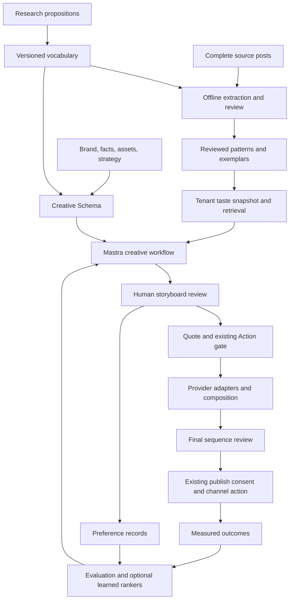
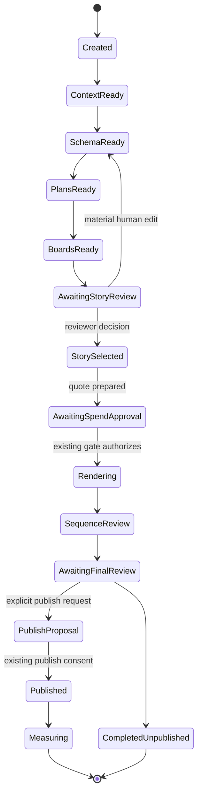
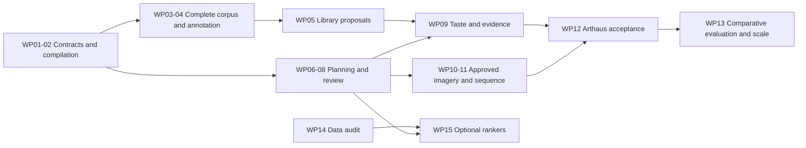

# Creative core: narrative, storyboard, and corpus architecture

**Version:** 1.0 · **Date:** 2026-09-20 · **Status:** implementation and research plan.

This is the canonical forward plan for Marketing OS's creative core. It covers
single images, carousels, and short videos from source evidence to reviewed
storyboard, imagery, publication, and learning. It incorporates the supplied
research and TRD, the actual repository boundaries, and the live corpus pilot.
Capabilities described as planned are not implemented merely by appearing here.

## Contents

1. [Outcome and scope](#1-outcome-and-scope)
2. [Verified starting point](#2-verified-starting-point)
3. [Architecture decisions and corrections](#3-architecture-decisions-and-corrections)
4. [System ownership and dependency boundaries](#4-system-ownership-and-dependency-boundaries)
5. [Narrative ontology](#5-narrative-ontology)
6. [Versioned artifact contracts](#6-versioned-artifact-contracts)
7. [Interactive workflow and state](#7-interactive-workflow-and-state)
8. [Critique, diversity, and bounded repair](#8-critique-diversity-and-bounded-repair)
9. [Assets, rendering, and approval](#9-assets-rendering-and-approval)
10. [Corpus acquisition and extraction](#10-corpus-acquisition-and-extraction)
11. [Representation, clustering, and pattern admission](#11-representation-clustering-and-pattern-admission)
12. [Taste retrieval and knowledge consumption](#12-taste-retrieval-and-knowledge-consumption)
13. [Storage, provenance, and operations](#13-storage-provenance-and-operations)
14. [Outcome and preference learning](#14-outcome-and-preference-learning)
15. [Research program and evidence register](#15-research-program-and-evidence-register)
16. [Evaluation and acceptance gates](#16-evaluation-and-acceptance-gates)
17. [Implementation work packages](#17-implementation-work-packages)
18. [Rollout, risks, and operating checklist](#18-rollout-risks-and-operating-checklist)
19. [TRD requirement traceability](#19-trd-requirement-traceability)

## 1. Outcome and scope

The product must propose a story a person wants to tell, explain what each beat
adds, and preserve that decision through visual realization. A finished image,
valid JSON, or a favorable model score is not sufficient acceptance evidence.

The first completed vertical slice is an Arthaus carousel with:

- several materially different text-first candidates and visible rejection reasons;
- a human-selected storyboard before new imagery generation;
- at least one observed transition pattern linked to inspected complete posts;
- feasible artwork sourcing and explicit continuity;
- a quoted imagery run using the existing approval system;
- final sequence review, with publishing consent handled separately;
- retained alternatives, edits, provenance, costs, and review decisions.

The architecture supports that slice without first building a trained reward
model, graph infrastructure, adapters, or a custom storyboard editor. Those
capabilities have research gates and integration points below.

### Scope boundaries

Build the creative contracts, Mastra workflow, corpus pipeline, retrieval policy,
review evidence, and renderer adapters. Reuse brand/fact readers, claims guard,
Action gate, review links, publishing consent, and tenant credential broker.
Do not rebuild provider models, the merchant control plane, or existing channel
publishing machinery. Atelier remains a reference implementation to learn from.

Organic editorial work is a first-class use case. A post may seek recognition,
curiosity, appreciation, or discovery without making a purchase argument.
Persona/decision-factor data enriches a relevant brief; absent data is explicit
and does not force every organic story into problem-agitate-solve or a CTA.

### Document authority

This document supersedes forward design choices in the earlier
[TRD reconciliation](plans/storyboard-harness/TRD-RECONCILIATION.md) where they
conflict. [Spec 33](../spec/33-THE-STORYBOARD-HARNESS.md) retains the diagnosis,
load-bearing constraints, and implementation history. Code remains the source
for what is actually shipped. Every implementation PR updates its relevant spec
section and this plan's status rather than claiming the whole plan is complete.

The [supplied research](plans/storyboard-harness/sources/research-report.md) and
[original TRD](plans/storyboard-harness/sources/original-trd.md) are preserved as
source documents. They are not executable instructions or independently verified
statements of our infrastructure. Section 15 records the evidence actually checked.

## 2. Verified starting point

Local implementation baseline: `b397330` atop corpus commit `405459a`. These are
branch artifacts, not a claim that the work is deployed or merged to `main`.

| Area | Implemented or observed | Still missing |
| --- | --- | --- |
| `packages/storyboard` | Beat IR; grounded three-option planner; independent model critics; source/asset checks; candidate loop | CreativeSchema; separate plan and presentation artifacts; durable interactive workflow; calibrated criticism |
| Template | `social_storyboard_plan`; fresh tool-less Mastra model adapter; reviewed context reader | Persisted review/resume integration, richer contracts, template regeneration coverage |
| `packages/storyboard-corpus` | Local ordered-media runner; real Vertex adapter; schema/coverage checks; JSONL ledger and cached resume; field normalizer | Full-media reacquisition; annotation v2; batching service; clustering; admitted library |
| Evidence consumer | `social_genome_read` defaults to counted layouts; research remains explicitly uncounted | Typed treatment and transition library; audit-linked admission |
| Generation/governance | Existing platform gate and channel governance available as integration surfaces | New quoted storyboard dispatch registered through them; end-to-end proof of no bypass |
| Validation | 32 storyboard tests and 28 corpus tests reported at their implementation checkpoints; corpus build/typecheck pass | Human storyboard acceptance; calibrated extraction of actual arcs; final sequence evaluation |
| Assets | Framed product render defect verified in handover | Verified bare masters or owner-approved framed-object creative route |

Progress after this baseline (2026-09-24, in stacked draft PRs): the acquisition
contract now distinguishes expected from recovered children and freezes a
24-carousel recovery slice. A staged v2 extractor separates pixel observations
from caption-aware narrative interpretation. Its local CLI verifies ready
snapshots and mirrored bytes, records unreviewed results, and resumes exact
inputs from a JSONL ledger. A measured three-single-image ledger run succeeded,
followed by source-complete three-, six-, and ten-slide carousels from frozen
recovery targets. The short merch sequence swaps focal products while retaining
a route motif; the medium gallery sequence changes views then moves to a
sculpture detail; the long book sequence maps ten slides to four proposed beats.
These are unreviewed observations, not admitted patterns. Reusable bounded
Apify/CDN/GCS recovery now exists, including explicit owner/coauthor evidence.
These increments advance WP03 and WP04 but do not meet either work package's
exit gate. See the
[pilot report](plans/storyboard-harness/CORPUS-PILOT.md) for measured results
and remaining acquisition limits.

The next bounded contrast slice raised the count to five source-complete still
carousels (30 slides), while one six-child mixed image/video post remains
ineligible for still-only extraction. A B-tier art-to-shirt sequence is a useful
artwork-to-product presentation example; a C-tier wedding stationery sequence
requires a relevance decision before joining an artist-focused library. Real
annotation failures also motivated a validated pixel-stage checkpoint, so
caption-only changes no longer repeat image calls. Explicit Vertex response
schemas improved long-sequence field validity, but the model still interpreted
black rectangles as censorship without source support. WP04 therefore needs
an evidence-support review, not just schema-valid JSON, before pattern admission.

The live three-single-image pilot inspected actual pixels with
`gemini-3.1-pro-preview`: 3/3 valid results, 4,444 reported input tokens and 761
output tokens, with no thinking-token field returned. Resume reused the results.
These observations established basic visual treatment extraction. They did not
validate a narrative taxonomy, performance prediction, or carousel understanding.
See the [pilot report](plans/storyboard-harness/CORPUS-PILOT.md).

Pilot receipt: run `field-pilot-20260919`, local ledger
`/private/tmp/corpus-pilot-ledger.jsonl`, inputs
`/private/tmp/corpus-reviewed-pilot.json`; outputs refer to the three source post
IDs documented in the report. These temporary paths are session evidence, not
durable production storage. WP00 archives their manifests/receipts in the scoped
research store before future work relies on them. Here, valid means schema and
supplied-media coverage validity; direct visual review was a separate manual check.

### Corpus denominators

Bucket: `gs://arthaus-creative-corpus/`, project `arthaus-us`.

| Lane | Known inventory | Permitted inference |
| --- | --- | --- |
| Original organic pilot | 40 artists, 923 posts: 399 singles, 345 carousels, 179 video, as recorded in handover | Metadata and engagement survived; expired CDN samples require media recovery |
| Field cohort, directly audited | 504 account files; 6,958 rows; 6,947 distinct shortcodes; 6,927 JPEG objects | A broader, mixed-relevance pool; do not call all accounts working artists |
| Field singles | 1,337 rows; 1,332 with saved images | Available single-image extraction candidates, not 1,332 brand-approved exemplars |
| Field carousels | 3,020 rows; 3,006 saved covers | Cover analysis only until full ordered media is recovered |
| Field video | 2,601 rows; 2,588 saved posters | Poster analysis only until temporal/audio media is recovered |
| Paid ads and layout-synth | Historical 393 images, 198 layout inputs, 66 quarantined, 132 clustered, 39.4% retained-cluster coverage | Separate audit workstream; reported history is not a newly measured run |

Thirty-two field rows lack `imageFile`; one saved JPEG is not referenced by the
metadata. Eleven shortcode duplicates appear across accounts; current normalization
quarantines all 22 appearances. Preserve occurrence aliases in the next version.
There are 778 negative like-count sentinels. These mean unknown, not zero.
Do not add the two organic lanes before cross-lane deduplication.

None of those 22 duplicate appearances is an `Image` row in the audited snapshot;
the 1,332 available single-image candidates therefore remain after the current
duplicate quarantine. Their relevance and brand eligibility still need review.
`social_genome_read` remains a legacy layout consumer, not the planned audited
treatment/transition library.

## 3. Architecture decisions and corrections

| Decision | Rationale and consequence |
| --- | --- |
| Mastra orchestrates interactive work; offline extraction runs beside it | Share contracts and provenance, not latency or request lifetime |
| Separate CreativeSchema, NarrativePlan, Storyboard, and RenderHandoff | Strategy, story, presentation, and provider effects have distinct review and invalidation rules |
| Preserve beats; add presentation units | A carousel panel, video shot, and narrative beat are different units |
| Default K=4 is an initial engineering configuration | Benchmark K=3/4/6 under equal budgets; four is not a literature-derived minimum |
| Branch independently before comparison | Four plans in one completion can anchor each other; compare independent calls against the current cheaper joint call |
| Soft preferences use explicit policies | Decimal control values are not calibrated probabilities and do not imply separate temperatures within one model call |
| Plan/storyboard selection precedes new imagery spend | Reuse source thumbnails for review; new generated keyframes are imagery and require the same spend authorization |
| Human taste, factual validity, and predicted outcome remain separate | Avoid calling a popular post true, a correct post interesting, or a preferred post a conversion winner |
| Retrieval and reference conditioning precede tuning | Scraped field images are structural research, not automatically the brand's aesthetic or training dataset |
| Primary files plus blob artifacts; graph/search are projections | Keep store-owned creative truth inspectable; do not make FalkorDB a prerequisite |
| Evidence is qualified by kind and scope | Counted treatment evidence from a single is valid; counted transition evidence requires an observed sequence |
| Cache replay is reproducible; new remote inference need not be | Seed and configuration hashes identify an experiment, not a guarantee of identical regeneration |
| Outcome ranking is a later independently gated service | No dependence on assumed Bonnard/Axon data availability to ship text-first review |
| NeuroGraph persona context is primarily MCP-based | The customer's NeuroGraph agent supplies optional persona/scenario context; no embedded graph client is required |
| Creative outcome intelligence belongs to NeuroGraph Creative Review | Reserve an optional adapter for its skill, tools and model; leave implementation empty until the joint client deployment integration is built |

Additional corrections to the supplied TRD:

- Literature results on long prose do not establish a 15-point carousel quality
  gain, 73% universal judge ceiling, or a 78% ceiling on brand taste. Those are
  study-specific results; local gates need local baselines and uncertainty.
- Pairwise preference and measured outcomes are different labels. A human
  choosing a candidate does not label every unseen sibling as bad.
- Do not require one shot per beat or exactly one beat per shot. A still can
  imply setup and reveal spatially; one beat can span several panels. Use an
  explicit many-to-many realization map with a primary beat for navigation.
- Negative taste examples belong to the taste/narrative review context. They
  are not deterministic structural violations merely because they were rejected.
- Keep intended viewer emotion separate from observed viewer response. Neither
  an extractor nor a Director can measure audience emotion by naming it.
- Character/asset consistency is a provider capability to test per run. It is
  not assumed solved for the products and scenes this system generates.

## 4. System ownership and dependency boundaries



### Repository map

Paths below are relative to the named repository. New paths are proposed until
their work package lands. The local worktree name `marketing-os-storyboard` is
not a new architectural repository.

| Owner | Existing seam | Planned responsibility |
| --- | --- | --- |
| `marketing-os` | `packages/storyboard/src/{types,schemas,plan,critics,explore}.ts` | Portable contracts, validation, planning functions, typed findings, review payloads |
| `marketing-os` | `packages/storyboard-corpus/src/{index,vertex,field-cohort,cli}.ts` | Acquisition manifests, extraction v2, normalization, audit, batch adapters, pattern proposals |
| `marketing-os` | `packages/marketing-os/templates/agents/src/mastra/tools/storyboard.ts` and `storyboard-model.ts` | Tenant-scoped workflow binding, stage routing, review/resume adapters |
| `marketing-os` | Template `lib/storyboard/`, `lib/social/`, `src/mastra/tools/actions.ts` | Generated installs consume the same contracts and existing proposal flow |
| `marketing-os` | `packages/skills/social-media/`, `packages/skill-kit/`, `packages/design-surfaces/` | Claim checks, artifact contracts, channel actions and renderer integration |
| `marketing-os-app` | `app/lib/actions.server.ts`, `app/lib/broker.server.ts`, `app/lib/jobs.server.ts` | Approval/dispatch authority, scoped credentials, durable job dispatch and budget reservations |
| `marketing-os-hosted-agents` | `src/mastra/`, service-only `app/api/actions/execute/route.ts` | Template parity plus per-request tenant routing; approved execution only |
| `Arthaus-Inc/marketplace` | `agents/social/`, `agents/brand/` | Reviewed brand artifacts, creative runs, first acceptance examples |
| `marketing-os-agents` / NeuroGraph providers | Customer-agent persona context primarily over MCP; proprietary Creative Review skill/tools/model | Optional integrations for clients deploying both products; contracts reserved, implementations intentionally absent for now |
| `creative-agent` / Atelier | Explore/critique and provider protocol references | Architectural reference; no core import |

Core dependency direction is `runtime -> storyboard contracts`; corpus output is
admitted through a library contract before runtime use. No renderer, credentials,
database client, provider SDK, or platform executor enters `packages/storyboard`.
Provider adapters implement ports outside that package.

Initial research execution can use operator gcloud credentials as in the pilot.
Production jobs use workload identity or broker-issued scoped credentials;
interactive model tools never receive durable secrets. The offline research
store and a tenant's private taste store are separate access domains.

## 5. Narrative ontology

The ontology is a versioned annotation vocabulary, not a list of compulsory
story templates. Begin small, allow `other` with an explanation, record unknowns,
and test whether humans can apply it consistently before expanding it.

### Units and relationships

| Unit | Meaning | Identity / relationships |
| --- | --- | --- |
| SourcePost | One platform content identity | `platform:postId`; repost occurrences retained separately |
| Occurrence | Account, publication time, capture and metric snapshot | Many occurrences may refer to one deduplicated content group |
| MediaItem | One source image or video asset | Content hash, MIME, order, ownership and availability |
| Observation | A visible/audible finding with a locator | Image region, panel, video interval, transcript span |
| Beat | One meaningful update to what the reader understands or expects | Supporting observations; reader state before/after |
| Transition | Relationship between beats or presentation units | Source/target IDs; observable changes and interpretation |
| PresentationUnit | Still canvas, carousel panel, or video shot | Explicit format subtype and realization mapping |
| Pattern | A reusable mechanism with conditions, limits and evidence | Examples, counterexamples, review/version and allowed use |
| Taste judgment | Preference in a particular brand/brief/reviewer context | Candidate pair, rubric, rationale, uncertainty, scope |

Do not force a model to invent a `turn`. A catalogue, repetition, or a single
pleasing image is a valid annotation. Whether it serves the brief is a later
judgment. The current required `assertion` becomes a semantic beat statement;
only factual claims require factual substantiation. An intended pause is not
a product fact and should not need an invented citation.

### Starting dimensions

These are proposed v0 terms for calibration, not empirical discoveries.

| Dimension | Initial terms | Required grounding |
| --- | --- | --- |
| Communicative function | introduce, question, contrast, demonstrate, explain, reveal, resolve, invite, pause, repeat | What information the unit supplies |
| Hook mechanism | withheld identity, scale ambiguity, incongruity, direct question, process entry, sensory detail, recognizable scene, none | Visible/textual device and unresolved reader question |
| Transition operation | reveal, replacement, zoom/reframe, context expansion, comparison, progression, cause/consequence, reversal, accumulation, repetition, no-change | Concrete source and target observations; replacement was added after the first real carousel showed a focal product swap with a persistent graphic motif |
| Proof mode | product fact, visible detail, demonstrated process, attributed testimony, measured result, none | Evidence origin; no inferred material/process claims from appearance alone |
| Continuity | fixed object, recurring character, palette, setting, spatial relation, motif, text device, audio motif | Bound asset/entity IDs; distinguish semantic motif from visual identity |
| Treatment | photograph, illustration, typography-led, collage, diagram, process capture, mixed | Locatable examples; camera terms optional when applicable |
| Intended response | curiosity, recognition, tension, surprise, appreciation, confidence, reflection | Explicitly an interpretation/design intent, never measured audience response |
| Composition | hierarchy, crop, focal region, negative space, visual contrast, text/image relationship | Normalized region coordinates and viewable source |

Global arc labels such as transformation or problem/solution are optional derived
summaries. Polti, three-act, emotional-curve and System1 terms remain researched
vocabularies until they improve annotation or selection on this task. Do not
require every post to instantiate a dramatic arc or assign a neuroscience claim
to a compositional label.

### Meaning before presentation

A beat records `readerStateBefore`, `informationAdded`, `readerStateAfter`,
`openQuestion`, and `resolutionOf` where useful. These are short, reviewable
statements, not hidden chain-of-thought. A transition cites the visible change
and explains its hypothesized narrative function separately.

Novelty is evaluated on reader question, information order and mechanism as well
as surface appearance. This avoids rewarding four palettes of the same story.

## 6. Versioned artifact contracts

All schemas are JSON-serializable and generated from one typed definition with
runtime validation. Reject unknown authority/evidence fields at trust boundaries.
Store schema versions, migration policy and feature capabilities explicitly.
The following shapes are proposed contracts, not today's exports.

### Shared envelope and provenance

```ts
type ArtifactEnvelope<T> = {
  id: string;
  schemaVersion: string;
  tenantId: string;
  brandId: string;
  revision: number;
  contentHash: string;
  createdAt: string;
  derivedFrom: string[];
  provenance: {
    briefRef?: string;
    sourceSnapshotRefs: string[];
    vocabularyVersion: string;
    modelConfigRef?: string;
    promptVersion?: string;
    creator: { kind: "human" | "service" | "model"; id: string };
  };
  payload: T;
};
```

Tenant scope comes from authenticated runtime context, never model output. Hash
canonical payload plus approval-relevant provenance; exclude the hash itself.
Model configuration records provider/model version if available, generation
settings, prompt hash, tool availability and request/response IDs. No secrets.

### CreativeSchema

| Field | Contract |
| --- | --- |
| `objective` | Intended audience response and business/editorial purpose; success metric if known |
| `strategy` | Optional persona/scenario/angle/decision-factor refs, plus `availability: supplied/absent/partial` |
| `constraints[]` | ID, dimension, rule, source ref, severity, validation method; hard constraints are non-negotiable |
| `preferences[]` | Dimension, preferred values, strength, rationale, allowed deviation; strength is policy metadata |
| `freedom[]` | Explicit open dimensions within hard constraints; never permit invented facts or unauthorized asset use |
| `narrativePriors[]` | Versioned hook/mechanism IDs with evidence class and provenance |
| `format` | Discriminated single/carousel/video target; channel limits supplied by a versioned capability profile |
| `assetInventoryRef` | Immutable snapshot of eligible assets and allowed transformations |
| `proofRequirements[]` | Claims/decision factors that genuinely apply to this brief; do not require all known factors in every post |
| `toneAndPacing` | Qualitative direction; timing only for time-based formats |
| `budgetPolicyRef` | Planning limits and quote policy, never an approval token |

Compilation is mostly deterministic: gather authoritative sources, copy hard
constraints, surface contradictions, then let a bounded model propose optional
mechanisms. Each generated preference is marked generated. Conflicting hard rules
produce `needs-input` with the exact conflicting sources; the model cannot choose
which governing rule to ignore. Missing persona data can use editorial mode;
missing required product facts cannot be filled with a prior.

### NarrativePlan

Fields: `schemaRef`, `premise`, `readerQuestion`, `payoff`, `mechanismRefs`,
`beats[]`, `transitionGraph`, `entityBible`, `exemplarSelectionRef`,
`distinctivenessRationale`, and `supportSummary`.

Each beat has semantic intent and information change, optional factual `claims`,
intended response, and evidence refs. The transition graph allows parallel
comparisons, callbacks and repeated motifs while ordered presentation remains
explicit. Generated plans do not inherit an `observed` label: individual moves
may be supported by observed patterns; the new creative is still an untested
application of those patterns.

### Storyboard

```ts
type Unit =
  | { id: string; kind: "still"; canvas: CanvasIntent }
  | { id: string; kind: "panel"; ordinal: number; canvas: CanvasIntent }
  | { id: string; kind: "shot"; startMs: number; endMs: number;
      scene: SceneIntent; audioIntent?: AudioIntent };

type Realization = {
  beatId: string;
  unitId: string;
  primary: boolean;
  locator?: { region?: [number, number, number, number]; intervalMs?: [number, number] };
};

type StoryboardPayload = {
  schemaRef: string;
  planRef: string;
  units: Unit[];
  realizations: Realization[];
  continuityBindings: ContinuityBinding[];
  claims: ClaimPlacement[];
  captionDraft?: string;
};
```

`CanvasIntent` expresses subject, action, visual hierarchy, text placement intent,
framing, treatment and asset bindings. `SceneIntent` adds shot size, angle,
movement, setting and entity relations. Neither contains a provider/backend.
Text and audio have per-format limits and claim refs. One still may realize
several implied beats; multiple shots may realize one beat. Validation requires
every beat to be realized and every unit to serve at least one beat. Temporal
intervals must be consistent; carousel order is not fabricated duration.

Continuity binds identity and invariants to assets or reference frames. It may
allow explicitly planned changes such as room/context expansion. An axis rule
only applies to a scene with that spatial relationship, not every carousel.

### Claims and support

`ClaimPlacement` identifies a factual assertion, its source, exact surface
(caption, on-image text, VO, demonstration), and validation status. Source
existence is insufficient: textual entailment and visual fidelity need appropriate
checks. Asset-derived facts are limited to what the source can support.

Replace the current whole-story `observed/hypothesis` shortcut with:

```text
support per move = observed-transition | observed-treatment |
                   researched | brand-preference | unsupported
support applicability = reviewed | unreviewed | contradicted
```

This fixes the current transition-only pattern shape, which cannot represent a
valid counted single-image treatment. `evidence.n`, when emitted for compatible
consumers, is derived from unique inspected post memberships. Research records
have no count field. Pattern linkage alone never proves a novel plan works.

### ReviewPacket and ReviewDecision

Packet: artifact hashes, candidate order, options, typed findings, support by
move, source thumbnails, plain-language premise/beat changes, cost status and
required decision scope. A reviewer's first comparison can conceal model scores
and randomize candidate placement. Accessibility text describes each panel.

Decision: authenticated reviewer identity, scope, exact packet hash/revision,
approve/reject/edit/tie/abstain, compared IDs, field-level edits, reasons, time,
and applicable existing gate receipt. A content hash is never authorization.
The product can capture taste feedback without granting imagery or publish scope.

### RenderHandoff and GenerationAttempt

Handoff binds selected storyboard revision, adapter version, available models,
asset/reference hashes, per-unit generation or reuse request, maximum alternatives,
repair allowance, pricing snapshot and total quote to an existing action proposal.
Provider prompts and seeds live here; they are derived, inspectable execution data.

An attempt records idempotency key, reserved cost, provider job ID, state, output
artifact hashes, returned usage, actual billed cost if known, and error class.
Timeout is `outcome-unknown` until reconciled, not permission to dispatch again.

### Library and learning contracts

| Object | Required payload |
| --- | --- |
| `CorpusSnapshot` | Manifest hash, source identities/occurrences, completeness, licenses/use scope, capture/metric times |
| `PostAnalysis` | Observation v2, annotation graph, media locators, modality coverage, model/prompt/schema versions |
| `PatternProposal` | Mechanism, applicability, evidence memberships, counterexamples, uncertainty, cluster experiment ref |
| `PatternVersion` | Reviewed proposal, admission identity/reason, support type, usage restrictions and unique-post count derivation |
| `TasteSnapshot` | Tenant/brand scope, approved exemplars, qualified negatives, preference statements and revision |
| `PreferenceRecord` | Actual compared candidates, display order, brief/rubric/reviewer, choice/tie/abstain, revisions |
| `OutcomeRecord` | Published asset/platform IDs, channel/placement, exposure denominator, metric window, attribution and assignment metadata |

All measurements distinguish `unknown`, `not-applicable`, and measured zero.
Approved source truth is retained; retrieval/search/graph records can be rebuilt.

## 7. Interactive workflow and state

### Stage sequence

1. Resolve tenant, objective, source snapshots and model/budget policies.
2. Compile and validate CreativeSchema; suspend for material source conflicts.
3. Retrieve a bounded evidence/taste pack and record inclusion/exclusion reasons.
4. Director generates K independent NarrativePlans, each from an assigned
   mechanism/freedom/exemplar configuration.
5. Validate facts and plan coverage; compare mechanisms and shortlist for boarding.
6. Storyboarder expands candidates to format-specific units and realization maps.
7. Structural validator and advisory narrative editor issue typed findings.
8. Apply at most one allowed repair per candidate, revalidate its dependency closure,
   and retain both revisions. Recompare candidate diversity.
9. Suspend at human storyboard review with rejected options still visible.
10. After selection, obtain a provider-specific quote and imagery approval through
    the existing Action gate. Source thumbnails do not require new generation.
11. Dispatch approved work; inspect per-unit outputs and the complete sequence.
12. Human reviews the final composition; existing save/claim and publishing gates
    control artifact writes and distribution. Record decisions and outcomes.

Plans and boards can be shown early, but mandatory imagery authorization binds
the selected board, not just an abstract premise. If boarding changes a selected
plan materially, obtain a new storyboard decision before quoting generation.

### Durable state machine



Every active state also permits `cancelled`, `failed`, or `needs-input` with a
typed reason and retained outputs. Failed/no-survivor runs return complete audit
material and never silently fall back to the old single-candidate composer.

Mastra runs typed stages with persisted checkpoints and suspend/resume. Recovery
uses the installed, pinned API version; current documentation confirms the
[workflow capability](https://mastra.ai/docs/workflows/suspend-and-resume), but
implementation must validate those APIs against the repo's locked version.
Workflow resume requires a trusted server-side decision, not a model-supplied
`approved: true` value. A checkpoint is operational state, not creative approval.

### Concurrency and invalidation

Use bounded fan-out (initial K=4, concurrency=2), isolated tool-less creative
calls, and immutable shared context. A stage lease plus compare-and-swap revision
prevents two resumes from publishing competing successors. Outbox entries record
external dispatch before work leaves the service; reconcile provider receipts.

Schema edits invalidate descendants. Plan changes invalidate its boards and
quotes. A reference asset, claim, substantive copy, or continuity change invalidates
affected outputs and approval hashes. A small copy edit may reuse image bytes,
but still needs fresh final content review. Explicitly record reused artifacts.

## 8. Critique, diversity, and bounded repair

| Evaluator | Inputs | Output / authority |
| --- | --- | --- |
| Structural | Schema, graph, source refs, assets, format capabilities | Typed violations; blocks objectively invalid execution |
| Narrative | Full plan/board, alternatives, recent moves, reviewed patterns | Advisory findings on information gain, earned reveal, payoff and repetition |
| Taste | Brand taste snapshot, objective, visible references | Preference reasons with contextual uncertainty; no universal score |
| Visual fidelity | Actual candidate pixels, source artwork, unit intent | Observable mismatch findings; unsafe/incorrect assets excluded |
| Sequence | Full ordered panels or clip plus sound/text where present | Continuity, timing, repeated information, crop/readability and final claim findings |
| Performance (future) | Stage-appropriate features and deployment context | Calibrated rank distribution with uncertainty; no approval authority |

Findings carry `code`, `severity`, `artifactRef`, `locator`, `evidenceRefs`,
`reason`, `suggestedChange`, and `confidenceKind`. Hard failures, soft preferences,
uncertainty, and missing inputs are different statuses. Inaccessible pixels mean
`unassessable`, not a negative taste training label. Keep reviewer overrides for
subjective rejection while prohibiting overrides of missing legal/factual scope
or unauthorized execution through a taste choice.

Narrative checks must distinguish an actual changed inference from renamed role
labels. A reader should be able to point to what was withheld, added or resolved.
No mandatory rejection quota: if all options survive, show that the acceptance
criterion of an agreed rejection has not yet been demonstrated.

### Diversity policy

Assign different reader questions and mechanism choices before inference, rotate
exemplars, and reserve one branch for source-grounded exploration without a
specific pattern anchor. All branches still obey brand/claims constraints.
Measure structural differences plus text/presentation embedding distances;
normalize each feature view and record embedding versions. Do not compare raw
distances across embedding models or conflate color variation with narrative novelty.

Initial diversity floor is advisory until calibrated against human judgments of
same-story/different-story pairs. Test the TRD's 10% spread-loss alert rather than
treating it as a universal safety threshold. Require a meaningful set-level
diversity review for release. Replenish at most two collapsed branches; then
report insufficient diversity instead of looping indefinitely or weakening rules.

### Patch-only repair

A RepairRequest names permitted artifact paths and violating dependencies. The
model emits constrained JSON Patch-like operations with precondition hashes.
Reject edits outside the allowlist, changed IDs, new claims without sources or
unrelated rewrites. Persist before/after diff. A continuity change may affect
several units; expand the review/validation dependency closure deliberately.

Initial limits: one repair pass per candidate before story review and one quoted
image repair per failed unit afterward. These are configurable work limits.
Failed repair does not create permission to expand the budget.

## 9. Assets, rendering, and approval

### Bare-artwork prerequisite

Audit the product asset catalog before any mockup run. Each asset records kind,
dimensions, original source, rights/use scope, artwork identity, verification
source and permitted transformations. A model's assertion that a framed image
is bare artwork is not verification.

Preferred route: obtain the actual master and reconcile it to the product/work.
If unavailable, select a brief that treats the existing framed render as a framed
object. A detail crop is allowed only within supported resolution/fidelity and
may not suggest material texture that was not captured. Automated frame removal
is a separate experiment requiring inspection; it never silently substitutes for
a master. Owner input is necessary only to identify/verify inaccessible masters
or choose a materially different creative objective.

### Governance sequence

```text
Human storyboard selection
  -> immutable provider quote + asset/reference hashes
  -> planned imagery action using existing proposal / approval authority
  -> atomic cost reservation
  -> idempotent provider dispatch and receipt reconciliation
  -> full sequence review + claims validation
  -> final save/publish proposals through existing authority
```

Register any missing imagery action within the current action registry; do not
introduce a parallel approval service. Local and hosted runtime bindings must
map to their installed authority path. Model-readable tools can propose, inspect,
and explain; trusted executors perform approved mutations. Human taste selection,
imagery authorization, artifact admission and publish consent have explicit scope.

The storyboard-specific imagery action, reservation ledger and dispatch adapter
are planned WP10 work. The existing gate supplies the authority mechanism, not
an already implemented storyboard spending capability.

Quote includes successful and potentially billed failed attempts, references,
generation count, output dimensions/duration, repair allowance, provider pricing
version, currency and expiry. Preserve spec 33's current Veo ceiling of $2/render
as the configured project rule until the owner changes it. Do not assume it
applies to every provider or that candidate count enforces a dollar cap.

Persist reserved, reported-usage, reconciled-billed and remaining amounts. A
provider timeout can still be charged; hold its reservation until reconciled.
Retry only when provider idempotency/status supports it or a new authorized
attempt is explicit. Stop at the approved maximum, including concurrent work.

### Rendering and sequence QA

Provider adapters translate unit intent into capability-specific requests.
Reference assets and entity bindings are pinned. Video may use keyframe-first
generation after approval; the quote must include both keyframes and motion.
Check provider limitations before offering camera moves, aspect, duration or
reference conditioning. No silent model downgrade.

Composition uses existing Design Surface adapters. Inspect all ordered panels,
text overlays, captions, final crops, VO/transcript, pacing and audio rights.
A sequence review may reject individually attractive frames if the arc repeats,
identity changes, or the final text makes an unsupported claim. Only the final
approved artifact hash is eligible for the existing publishing action.

## 10. Corpus acquisition and extraction

### 10.1 Two pipelines with a shared vocabulary

Research ingestion creates `ResearchProposition` records: claim, source title/URL,
publication/version, population/task, study limitations, verification status,
proposed application, and associated vocabulary IDs. Human-authored brand
preferences use their own provenance. Neither can increment an observed count.

Visual ingestion creates auditable observations of actual media. It may use
researched terms for annotation, but the term's presence is not proof of a
mechanism's efficacy. The extractor proposes interpretations; admission reviews
both those interpretations and their source evidence.

### 10.2 Acquisition manifest and completeness

Every source row remains in the inventory, including failures and exclusions.

```text
CorpusSnapshot
  source: platform, original post ID/URL, account occurrence, owning account,
          owner/coauthor attribution, publishedAt
  capture: metadataCapturedAt, mediaCapturedAt, collector/version, object generation
  media: ordered expected children, actual objects, checksums, MIME, dimensions
  coverage: expectedCount, acquiredCount, orderingVerified, modalitiesObserved
  metrics: values, missing/sentinel reason, observedAt, exposure if available
  scope: paid/organic, account role, relevance label, allowed research/use scope
  identity: canonical post ID, occurrence aliases, near-duplicate group
  disposition: ready / excluded / incomplete / expired / failed + reason
```

Preserve raw records; normalization is a versioned derived artifact. Keep existing
global-shortcode deduplication, then group cross-lane/perceptual duplicates for
split hygiene. Do not collapse distinct posts merely because their images look
similar; retain aliases and distinguish content deduplication from publication
occurrences. The first 40-artist cohort and field cohort require reconciliation.

For carousel recovery, use original post URLs/IDs where possible; handles are
fallback discovery keys. Fetch all children and preserve provider order,
child IDs, type and expected count. Support mixed image/video carousels. Mirror
bytes immediately to a scoped durable prefix; do not retain only fresh CDN URLs.
Verify decoded MIME/dimensions and compare returned identity to the requested
post. A source artist may be a documented coauthor while another account owns
the post; retain both identities and require explicit owner or coauthor evidence.
A tag alone is not sufficient. A page with two photos is not proof that a
ten-slide post is complete.

For video, retain the source clip where available and duration, shot boundaries,
audio availability and transcript alignment. Start with boundary-aware sampling
plus start/end and fixed maximum temporal gaps; tune sampling on the calibration
set. Preserve timestamps and extraction coverage. Dense motion or text reveals
trigger additional local samples inside a bounded budget. Uniform thumbnails
alone can miss the causal event.

Treat `visualSamplesCovered`, `fullVisualStreamCovered`, `audioCovered`, and
`transcriptCovered` separately. Sampling every supplied image successfully never
sets whole-video completeness to true. A clip whose story relies on dialogue
cannot qualify as fully annotated from silent frames. The current v1
`temporalCoverage.complete` means supplied-sample coverage only; v2 makes that
name explicit. Unknown modality stays unknown.

Acquisition jobs use per-host limits, bounded retries/backoff and persistent
status. A removed/inaccessible post is missing evidence. Replacing it in a
calibration slice is logged, with planned and realized sampling denominators.
Acquisition spend is separately capped from inference; no full re-crawl is
implied by running the small calibration slice.

### 10.3 Sampling design

Initial batches are planning allocations, not statistically powered benchmarks:

| Slice | Initial target | Stratification / purpose |
| --- | ---: | --- |
| Development singles | 40 (range 30–50) | Artist-relevant illustration/photo/process/type/promotion; plain, ordinary and unusual treatments |
| Development carousels | 24 (range 20–30) | Different accounts, lengths, presentation types and apparent mechanisms; complete children required |
| Development videos | 8–12 | Process, reveal, narration-led and montage; short enough for full source review |
| Locked extraction test | At least 20 new complete posts initially | Separate account/content groups; never used for prompt tuning; expand before scale claims |
| Critic/planner evaluation | Separate briefs and source examples | Avoid reusing reviewed extraction targets as memorized answer keys |

Use account/format-relative engagement strata only where meaningful; explicitly
include unknown engagement and ordinary/low-performing posts. Record selection
probabilities where available. Existing crawl selection may be biased; a larger
sample does not make it representative of all Instagram art. Do not promise a
generalizable performance model from this convenience corpus.

Capture split membership before prompt iteration. Keep accounts, duplicate
content groups, and near-identical derivatives together; future evaluation can
add a later-time holdout. When held-out data is consulted for tuning, retire it
as a test set and version a replacement.

### 10.4 Extraction v2 stages

**A. Deterministic preparation.** Validate identity and coverage; decode media;
record source and derivative hashes; extract dimensions, geometry and permitted
OCR/transcript candidates. OCR text remains untrusted source content.

**B. Grounded observation.** A frontier vision model receives ordered original
or documented derivative pixels, exact locators and modality labels. First
describe visible changes without engagement, caption interpretation, or prescribed
arc labels. Attach source refs to every finding. If a caption is supplied for
context, mark which findings depend on it; never treat it as evidence of unseen
pixels. Compare pixel-only versus caption-assisted stages in research R3.

**C. Narrative annotation.** A second bounded stage reads the complete post,
grounded observations, caption/transcript as labeled context, and vocabulary.
It proposes beats, information changes, hook/payoff relationships, continuity,
and counter-readings. Repeated panels or absent payoff are legitimate outcomes.
This stage may be a separate call or a separately validated section in one
multimodal response; the ablation determines the cost/quality tradeoff.

**D. Verification.** Deterministically check locator/ref validity, order, unit
coverage, bounds, required uncertainty and schema fields. On the calibration set,
human reviewers compare every output to the media. Later, use risk-based review
and random auditing; a second model can prioritize review but cannot self-certify
admission. Invalid outputs go to typed quarantine, not a dropped array element.

**E. Representation.** Emit frozen analysis plus versioned feature records for
clustering and retrieval. Keep raw model responses restricted for debugging,
parsed findings inspectable, and semantic interpretations separate from geometry.

### 10.5 Proposed analysis record

```ts
type PostAnalysisV2 = {
  postRef: string;
  snapshotRef: string;
  vocabularyVersion: string;
  mediaCoverage: ModalityCoverage;
  observations: Array<{
    id: string; mediaRef: string; locator: MediaLocator;
    visible: string; treatmentTags: string[];
    textSpans: TextSpan[]; uncertainty?: string;
  }>;
  transitions: Array<{
    id: string; fromObservationIds: string[]; toObservationIds: string[];
    observableChange: string; operation: string;
    interpretation: string; alternativeReading?: string;
  }>;
  beats: Array<{
    id: string; supportingObservationIds: string[];
    function: string; informationAdded: string;
    inferredReaderState?: string; claimRefs: string[];
  }>;
  narrative: {
    mechanism: string; hook?: string; payoff?: string;
    continuity: string[]; limitations: string[];
  };
  review: { state: "unreviewed" | "verified" | "disputed" | "rejected";
    reviewRefs: string[] };
  provenance: ExtractionProvenance;
};
```

Numeric confidence may be stored as a model self-report but is never interpreted
as a calibrated probability. Annotator disagreement is valuable data. Separate
`not-visible` from `model-unsure` and `not-applicable`. No `n`, reusable pattern
approval, or outcome efficacy is generated inside this record.

### 10.6 Resume, batch, cost, and scale

Upgrade cache keys to include source bytes, modality sampling policy, vocabulary,
model configuration, prompt/schema version, preprocessing version and observation
dependencies. Engagement-only updates do not invalidate pixel inference; they
version the metric record and downstream analyses. Caption changes invalidate
caption-dependent interpretation even if pixel observations can be reused.

The current JSONL pilot is one writer, concurrency one. Before distributed
execution, use a unique job/item key, atomic claims, leases and idempotent
completion in an operational store. Keep immutable input/output manifests and
per-item status. Reconcile batch responses by custom item identity, never response
order. A late result cannot overwrite a newer extraction revision.

Interactive calibration uses synchronous inference. After acceptance, non-urgent
shards use a provider batch adapter. Google's current
[batch documentation](https://docs.cloud.google.com/gemini-enterprise-agent-platform/models/capabilities/batch-inference)
advertises a discount relative to real-time inference; snapshot actual chosen
model pricing and capabilities before launch. No fixed dollar forecast is
inferred from the three-image transport pilot.

Estimate each shard from measured token distributions by format:

```text
inference estimate = sum(input tokens * input rate + billed output tokens * output rate)
total budget = inference + acquisition + preprocessing + storage + review + retry reserve
release next shard only if accepted yield and remaining reservation satisfy policy
```

Track estimated versus billed cost and p50/p95 tokens per post. Initial shard
caps: 25 complete posts for new extraction versions, then 100 after review;
these are proposed operator settings, not permission to spend. Output/timeout
caps and max posts are necessary but not invoice caps. Failures consume reserved
budget. Keep the successful v1 pilot intact as a baseline rather than relabeling
it as v2 evidence.

### 10.7 Paid-ad recovery lane

Audit the 66 quarantined layout records by parse, schema, acquisition and provider
failure class. Re-run only recoverable items with a pinned real provider and
separate ledger. Preserve original 198/132/39.4% denominators and report changed
definitions. Do not lower clustering thresholds silently to inflate coverage.
Paid-ad structure can seed hypotheses for organic work, but source lane and
performance context remain explicit in retrieval and evaluation.

## 11. Representation, clustering, and pattern admission

### Feature views

| View | Representation | Guards against |
| --- | --- | --- |
| Narrative sequence | Ordered operation/function tokens; graph edges; normalized information-change text | Identical covers hiding different later moves |
| Treatment | Versioned visual embeddings plus reviewed treatment tags | Geometry-only collapse |
| Composition | Normalized focal/text regions, crop, density and hierarchy | Prose ignoring concrete visual arrangement |
| Continuity/pacing | Entity-reference graph, changes/invariants; duration/gaps for video only | Every frame looking unrelated; invented carousel timing |
| Hook/proof | Initial question/device and location of substantiated proof/payoff | Catalogue similarity masquerading as story similarity |

Performance is held out of initial clustering so popular posts do not define the
ontology. Whiten/normalize feature views on development data; store preprocessing
parameters. Never concatenate differently scaled embeddings and call the result
a calibrated distance. Missing views are explicit, not zero vectors that pull
incomplete videos into a spurious cluster.

### Initial algorithm decision

Use reviewed tags plus per-view nearest-neighbor retrieval as the first baseline.
For complete sequence posts, compare agglomerative clustering on a composite
distance against a density-based alternative that retains noise/outliers. For
singles, compare treatment embeddings with treatment+composition. Tune only on
development partitions. Algorithm/library selection is part of R4; it is not a
reason to invent a minimum cluster size before enough sequence examples exist.

Each cluster experiment stores input membership, feature/embedding versions,
distance definition, parameters, assignments and unassigned records. Evaluate
human grouping coherence, split stability under resampling, mechanism separation,
artist concentration and outlier usefulness. Report size distribution as well as
coverage; high coverage from one bland cluster is not success.

Use cluster medoids and boundary examples for review, not just the highest
engagement image. A reviewer can split or reject a cluster. Keep rare individual
exemplars retrievable as such; a single example is neither erased nor promoted
as a proven general rule. If counted, its honest count is one with limited support.

### Pattern admission

A candidate pattern must state:

- the mechanism and the exact observable move;
- applicable formats, prerequisites and prohibited/unobserved extrapolations;
- example post IDs with media locators and reviewed annotation refs;
- counterexamples, alternative readings and failure modes;
- scope: treatment, transition, narrative arrangement, or brand preference;
- unique inspected membership and the count calculation;
- source lane and any descriptive performance summary with cohort/window;
- curator decision, rationale, version and review date.

Admission is a trusted service/human operation over extraction receipts and media
membership. A model cannot admit its own fabricated refs. A sequence pattern
requires complete coverage for the claimed relationship; a video-wide claim
needs relevant audiovisual coverage. Linkability is not sufficiency of support.

File layout proposal in the research artifact store:

```text
corpus/<snapshot>/manifest.json
analyses/<extractor-version>/<post-id>/<analysis-hash>.json
experiments/<experiment-id>/{config,assignments,review}.json
patterns/<pattern-id>/<version>.json
libraries/<library-version>/manifest.json
```

Use filesystem-safe encoded IDs. Tenant admission references this research
library through a reviewed snapshot; no automatic write into `genome.md`.
Existing genome consumers receive an explicit compatibility projection and only
after their evidence contract is satisfied.

## 12. Taste retrieval and knowledge consumption

This section specifies exactly where the corpus is used.

| Consumer | Retrieved material | What it can do |
| --- | --- | --- |
| Schema compiler | Researched vocabulary, objective-relevant reviewed pattern summaries | Suggest mechanisms and identify missing prerequisites |
| Director | Diverse complete-post examples, transition summaries, brand preferences | Create new reader questions and plans; cite applicable support |
| Storyboarder | Full ordered examples, treatment details, continuity devices | Translate semantic beats into presentation without copying artwork |
| Narrative/taste reviewers | Examples plus counterexamples and recent rejected/approved work | Explain repetition, unsupported analogy or brand mismatch |
| Visual/sequence reviewer | Original source artwork, selected intent, allowed references | Check fidelity, continuity and fulfilled narrative intent |
| Performance researcher | Frozen analysis features joined to outcome records | Test associations or prediction under a declared evaluation design |

The field corpus is a source of structural examples. The tenant taste store
contains brand-approved preferences and eligible exemplars. Being popular,
scraped, or structurally interesting does not make something on-brand.

### Retrieval procedure

1. Filter by tenant access, allowed use, format and evidence completeness.
2. Filter or score objective/mechanism compatibility; persona match is optional
   when absent and must not be inferred from an artist's audience without data.
3. Retrieve across narrative and treatment views separately.
4. Diversify across mechanism and source account; include a useful outlier when
   allowed, and keep an exploratory branch without a pattern-specific anchor.
5. Pack a bounded number of sources with their actual sequences/locators, support
   limits, and interpretation summaries. Record excluded candidates/reasons.
6. Persist the exact selection for each plan and the index/snapshot versions.

Start with the current reviewed manifest and manually selected examples. Evolve
to retrieval only when corpus size and annotation quality make it useful. Initial
context limits remain explicit; oversized packs are rejected or reselected with
a recorded policy, never silently truncated through the middle of a sequence.

Do not attach large image packs to every text stage. The Director can use reviewed
semantic summaries; the Storyboarder/reviewer receives relevant original media
when visual reasoning is required. Record whether a particular stage actually
saw pixels. A text summary cannot self-certify visual inspection.

### Taste feedback and adapters

Store preference context and reasons, not just thumbs-up/down. Distinguish off-brand,
factually wrong, infeasible, too similar, budget-limited, and simply not selected.
Only the appropriate dimensions train a taste model. An inaccessible candidate
or a failed provider request is not a negative aesthetic example.

Start with any useful curated exemplars; fewer than the TRD's proposed 20 is an
explicit cold start, not a reason to discard valid references. The proposed 100
frames for adapters is a planning heuristic, not a demonstrated training threshold.
Adapters require approved training rights, sufficient stylistic variety and a
held-out comparison against retrieval/reference conditioning. Do not train on
scraped artist images merely because they are in the research bucket.

Shared cinematic vocabulary may be learned from permissible non-brand examples
only if prompting demonstrably fails. No mandatory cinematic LoRA or provider
specific training dependency belongs on the first-release critical path.

## 13. Storage, provenance, and operations

### Authoritative stores

| Data | First implementation | Later projection / scaling |
| --- | --- | --- |
| Tenant schema, selected plans, boards, review records | Versioned JSON under `agents/social/storyboards/<run-id>/` via governed repository seam | Search/graph index, never sole source of creative truth |
| Unselected candidate revisions / large run traces | Immutable scoped blob artifacts, manifest refs retained in run | Lifecycle policy with deliberate deletion rules |
| Corpus media and analyses | Private GCS prefixes with immutable object generations/hashes | Warehouse index and embeddings |
| Job state, leases, outbox and budget reservations | Existing service persistence behind repository-independent ports | Transactional operational store as throughput requires |
| Reviewed pattern/taste manifests | Tenant-owned reference files plus cited immutable library refs | Per-tenant retrieval index |
| Preference/outcome events | Append-only event schema, local/service storage initially | BigQuery/dbt projection when an actual deployment needs it |
| Learned models | Versioned artifact plus dataset/eval manifest | Served model registry, independently deployable |

Graph vocabulary edges are useful: `GROUNDED_IN`, `REALIZES`, `SUPPORTS`,
`DERIVED_FROM`, `REVIEWED_AS`, and `MEASURED_BY`. Implement them as artifact
references first; a FalkorDB projection is optional. Search failure can fall back
to a pinned reviewed manifest; it must not fall back across tenant boundaries.

Append-only means immutable revisions with explicit tombstones/revocations,
not indefinite retention against a deletion policy. Propose a 12-month rejected-
candidate retention policy for product review, then decide from actual storage,
rights and tenant requirements. A revoked source invalidates future retrieval
and training eligibility; retain permitted audit metadata without continuing use.

### Integration gaps to implement explicitly

- The current storyboard tool has no persistence or authenticated human-decision
  endpoint. Add an adapter and action/review payload; do not infer approval from
  an assistant transcript.
- `packages/skills/social-media/src/authoring.ts` invokes `checkPostClaims` before
  writing a post. Preserve that backstop and apply appropriate checks earlier
  to on-image text, VO and asserted facts, with coverage beyond today's heuristics.
- The inspected hosted `social_post_upsert` invokes `upsertPost(socialRepo, input)`
  without the optional `BoundFacts` argument. WP11 must resolve trusted entities,
  handles, allowed link hosts and relevant palette facts from tenant sources and
  pass them explicitly. A model-provided provenance array is not a substitute for
  bound facts. Test both valid attribution and foreign/invented attribution.
- Storyboard evidence origins include `artwork`/`brand`; the current social
  provenance vocabulary differs. Map via verified sources, retaining the original
  origin; never coerce unknown model assertions to owner/data provenance.
- Existing Design Surface and `social_link_design` seams can attach a selected
  creative. They need storyboard revision, review and candidate lineage fields.
- Existing schedule/publish/cancel actions remain the distribution path. Their
  preview/content hash and revision checks must include final storyboard-derived
  content and asset changes where relevant.
- Existing social review pages need an arc comparison view; review-share feedback
  links must not be promoted into authorization tokens.
- `packages/design-loop/src/brand/persona.ts` and the inspected hosted brand-design
  adapter contain NeuroGraph stub paths. No verified storyboard-specific Bonnard/
  Axon outcome ingestion was found. These are intentionally unimplemented optional
  boundaries in the target plan, not missing prerequisites for the social agent.
  NeuroGraph integration readiness requires live sample payloads, identity
  mapping, scopes and failure tests, not tool names in a TRD.

### Optional NeuroGraph integration contract

Owner direction: persona and scenario intelligence will primarily arrive over
MCP from the customer's NeuroGraph agent. Creative outcome intelligence is the
proprietary NeuroGraph Creative Review skill, tools and model, accessed through
an optional adapter. Both implementations remain empty for now. Define portable
contracts and explicit unavailable behavior; do not build substitute persona
engines, graph clients, generic outcome predictors or pretend-success stubs to
fill them. The social agent must ship independently; joint deployments enable
these capabilities per tenant when both products are deployed and connected.

`PersonaContextPort` accepts the tenant-bound brief, objective and permitted
persona/scenario references. Its future MCP adapter returns a versioned context
snapshot with source references, scope, retrieval time, and availability
(`available`, `partial`, `unavailable`). Pin that snapshot to the CreativeSchema
for review and replay. Treat returned content as context, never authorization.
The customer agent owns persona reasoning; the social agent owns translating the
supplied context into narrative choices. Local editorial mode remains available
when the port is absent. Do not invent MCP tool names before the actual contract
is supplied.

`CreativeOutcomePort` accepts a stage-qualified creative packet (plan, storyboard
or rendered artifact), optional persona-context reference and requested review
objective. Reserve a response envelope for availability, provider/model version,
input hashes, assessments, rationale, uncertainty/abstention and evidence refs.
The detailed scoring schema belongs to the future Creative Review integration.
A simulated persona response or model prediction must be labeled as such; it is
not an observed business outcome. Keep observed metric ingestion in the separate
`OutcomeSource` port. Neither service can approve spending or publishing.

For now, unbound ports return explicit unavailable results; optional reviews are
shown as not assessed and cannot silently become positive scores or pass a gate.
Preserve deterministic checks, human review and the core narrative critics.
Later integration must verify tenant identity, entitlement, scoped credentials,
timeouts, partial results, version changes and data-use boundaries. Use the
existing broker for credential issuance, and existing governed paths for any
feedback writes. Do not export client creative or persona data for cross-tenant
training by default.

### Service ports and decision persistence

Keep business functions portable; bind these interfaces in the runtime/platform:

| Port | Operations / invariants |
| --- | --- |
| `CreativeArtifactRepository` | Read immutable revision; append draft revision through existing authorized authoring seam; compare-and-swap current ref |
| `CreativeRunStore` | Lease stage, checkpoint typed output, resume expected revision, cancel, record outbox item |
| `ReviewDecisionService` | Authenticate existing reviewer context; validate packet/revision; append scoped decision; emit resume event |
| `EvidenceLibrary` | Resolve reviewed pattern and original memberships within tenant/use scope; return pinned selection manifest |
| `AssetCatalog` | Resolve identity/allowed transformations and verified source; never infer bare status from a model response |
| `GenerationPort` | Estimate via provider adapter; dispatch only with valid gate receipt/reservation; query/reconcile provider job |
| `PersonaContextPort` | Optional customer-agent persona/scenario context, primarily MCP; unbound until NeuroGraph integration |
| `CreativeOutcomePort` | Optional proprietary Creative Review assessment; unbound for now; predictions/simulations distinct from observed outcomes |
| `OutcomeSource` | Fetch declared metric windows/exposure with provenance; explicit unavailable capability is a valid result |

Proposed selection record path:
`agents/social/storyboards/<run-id>/decisions/<decision-id>.json`, containing
reviewer identity, packet hash, board ID/revision/hash, decision scope, selected
and actually compared IDs, timestamp and existing authority receipt where needed.
The server-side ReviewDecisionService writes it through the tenant repository
adapter and emits an authenticated resume event. The runtime's model tool can
prepare the packet but cannot append an authoritative human decision. Operational
checkpoints need no repeated human approvals; irreversible or governed effects
still require the appropriate existing authority.

Proposed `SocialPost` extension is optional `storyboardBinding` with
`storyboardRef`, `selectedRevision`, `storyboardHash`, `reviewPacketHash`,
`finalReviewDecisionRef`, `renderHandoffRef` and `candidateLineageRef`. Add it to
parser/serializer and material-change rules. Include approval-relevant binding
hashes in `publishMaterial()` plus existing content/asset/surface material; retain
bookkeeping lineage separately if its change cannot affect what is approved.
Changing the selected board or final approval invalidates consent. Legacy posts
without a binding retain their existing behavior. Test preview hash, scheduled
cron recheck, material edits and frozen published posts against this migration.

### Initial capacity objectives

Pin an operator policy before runs: K=4, creative-call concurrency=2, one repair
per candidate, at most two diversity replacements and one quoted image repair per
unit. Give each stage input/output token, timeout and total-run limits; calibrate
the numeric token ceilings with the first representative boards rather than
cutting their JSON mid-output silently. A total run deadline cannot manufacture
approval or choose an unreviewed survivor.

Treat the TRD's 90-second plan/board target and 10-second future ranking target as
initial service objectives. Measure p50/p95 per stage, queue time, token cost and
human waiting time separately. Partial previews and durable suspension are the
first response to slow providers. Do not compromise evidence or expand spend to
meet an unmeasured latency promise.

### Operational safeguards

All reads/writes resolve tenant context per request and per job. Keep source URLs,
OCR, captions, transcripts and retrieved documents as untrusted data. Model output
is validated and cannot select credential scopes, execute commands, admit patterns,
or grant approvals. Private URLs sent to providers use short-lived scoped access
or actual bytes; logs contain hashes/refs and redacted diagnostics.

Run trace minimum: run/stage/item ID, tenant, source/model/config versions,
timings, token/usage fields including unknown, reservations, provider receipts,
schema failures, review decisions and artifact lineage. Separate operational
errors from creative rejection rates. Provide dashboards for acquisition
completeness, extraction accepted yield, unsupported claims, diversity alerts,
approval/edit rate, cost per accepted post and provider unknown outcomes.

Test recovery from worker death, stale review, duplicate callback, expired source
URL, incomplete batch, unavailable model, index outage, cancellation mid-generation
and quota exhaustion. Cancellation stops undispatched work, reconciles in-flight
effects and reports remaining billable exposure. Never hide partial success.

## 14. Outcome and preference learning

This section defines future evaluation and data requirements, not a commission
to implement a competing outcome model in the social agent. Creative outcome
modeling is owned by the NeuroGraph Creative Review integration. WP14/WP15
reserve and later validate that boundary for joint deployments; the adapter is
left empty now. Human taste preference experiments remain distinct from that
proprietary outcome capability.

### Learning ladder

1. Human review plus deterministic validity checks ships first.
2. Calibrate advisory model criticism against held-out review pairs.
3. Train a small preference ranker if enough genuine comparison labels exist.
4. Add a separate outcome model once exposure/attribution data is verified.
5. Test ranker-assisted selection in controlled deployment before automatic use.

Preferences and outcomes are not one ordered list of interchangeable truth.
Use separate targets/heads or services: brand preference, on-strategy judgment,
and a metric-specific outcome distribution. Weak model labels have separate
provenance and cannot dominate human/outcome validation.

### Pairwise preference ranker

A Bradley–Terry/logistic baseline is a reasonable first experiment:

```text
P(A preferred to B | context) = sigmoid(score(A, context) - score(B, context))
```

Fit on same-brief comparisons with reviewer/context effects where data permits.
Handle ties and abstentions explicitly; do not turn them into arbitrary winners.
Hold out briefs, content families and brands as appropriate. Report accuracy,
calibration, tie behavior, abstention coverage, subgroup performance and intervals.
Keep the simpler baseline if a richer model does not improve held-out results.

At plan stage use only features available before rendering: semantics, schema,
information changes and intended treatment. A post-render ranker can add actual
image/video features. Never train a plan-stage model on future keyframes and then
claim the same scoring contract operates before imagery spend.

### Outcome model and confounding

Organic likes/comments lack reliable impressions, audience exposure, publication
age and distribution controls. Within-account/format ranks are descriptive;
they do not estimate CTR or conversion. Paid and organic records remain separate.
Unknown metrics remain unknown rather than becoming negative examples.

For an outcome experiment require asset identity, impressions/exposure, metric
definition, attribution window, channel/placement, campaign/offer, spend, time,
audience assignment and data availability. Audit selection bias: only published
candidates have outcomes; rejected candidates have missing outcomes, not zero.
Protect against leakage from post-publication features and campaign descendants.

Compare against context-only, simple creative-feature, and appropriate generic
aesthetic baselines. Report held-out brands and temporal windows; a brand-ID
feature cannot give meaningful performance on an unseen brand without a defined
cold-start policy. Feature attribution is diagnostic, not proof against reward
hacking. Test counterfactual feature perturbations and spurious-correlation slices.

No automated cross-tenant learning is assumed. An approved aggregate-data contract
and appropriate isolation tests are prerequisites for any per-vertical model.
Where sharing is unavailable, use tenant-only data and report its limitations.

### Live experiment

Compare human-only selection versus human-plus-ranker under the same brief,
eligible creative pool, channel, exposure budget and attribution window. Choose
randomization unit and minimum detectable effect before launch; cluster standard
errors at the assignment unit and account for repeated measures. Avoid selecting
the best observed metric after the test. Approval remains human; the experiment
changes information shown or ranking, not publication authority.

Record intervention and selection propensity where practical. Retrain from
versioned datasets; evaluate in shadow mode, then canary with a rollback switch.
Never use the ranker as an RL generation reward in this plan's initial releases.
Any later preference optimization is a new research decision requiring diversity,
fidelity and independent human/outcome evidence.

## 15. Research program and evidence register

Research must resolve an implementation decision. Each experiment records its
hypothesis, dataset/split, baseline, changed factor, budget, human rubric, primary
metric, stopping rule, output and decision. Failed hypotheses are retained.
Do not expand the ontology or train a model simply because a paper used one.

### 15.1 Evidence checked for this plan

Primary landing pages/abstracts and official capability documentation below were
checked on 2026-09-20. This verifies the stated narrow findings, not all methods,
statistics or product extrapolations in the supplied synthesis. Full methodology
review is required before reproducing or using a result as a release criterion.

| Source | Verified contribution | How this plan uses it / limit |
| --- | --- | --- |
| [Re3, EMNLP 2022](https://aclanthology.org/2022.emnlp-main.296/) | Plan, recursive context, revision for longer story generation | Supports a structured workflow hypothesis; does not establish social-post lift |
| [DOC, ACL 2023](https://aclanthology.org/2023.acl-long.190/) | Abstract reports 22.5-point coherence, 28.2-point relevance, 20.7-point interestingness gains over Re3 in its study | Motivates plan control ablations; these gains are not our acceptance targets |
| [Dramatron, CHI 2023](https://arxiv.org/abs/2209.14958) | Hierarchical script co-writing evaluated with professionals | Motivates editable plans and human intervention; does not prove autonomous taste |
| [Doshi and Hauser, Science Advances 2024](https://pmc.ncbi.nlm.nih.gov/articles/PMC11244532/) | Reports individual creative gains alongside reduced collective diversity in the studied writing task | Motives to evaluate set-level diversity; no universal embedding threshold follows |
| [TTCW / Art or Artifice, CHI 2024](https://arxiv.org/abs/2309.14556) | Tested 48 stories with creative writers; tested LLM assessors did not positively correlate with expert assessments | Justifies human evaluation and judge calibration; not a claim about all future critics |
| [LitBench, 2025 preprint](https://arxiv.org/abs/2507.00769) | 2,480 test pairs / 43,827 training pairs; reported 73% OTS and 78% trained-model agreement | Makes BT a useful baseline; percentages do not transfer as brand-storyboard ceilings or gates |
| [Camera Artist, 2026 preprint](https://arxiv.org/abs/2604.09195) | Explicit cinematography agent and recursive storyboard generation | Candidate video implementation technique; no prerequisite for cinematic LoRA |
| [Mastra workflow docs](https://mastra.ai/docs/workflows/suspend-and-resume) | Suspend/resume and persisted run recovery are documented | Choose this capability; test concrete APIs against the pinned installed release |
| [Google batch inference docs](https://docs.cloud.google.com/gemini-enterprise-agent-platform/models/capabilities/batch-inference) | Non-interactive Gemini batch capability and advertised discount | Use after calibration; verify chosen model, modality limits and current pricing at launch |

The supplied synthesis also cites Plan-and-Write, reward models, LoRA studies,
attention studies, System1, creative-sales decompositions, and several new video
papers. Preserve those citations in the source report, but classify detailed
claims as `needs-methodology-review` unless the research record includes the
primary text and exact applicable result. In particular, a sales contribution
percentage, a 1.5-second attention claim, or a style-example count does not create
a hard constraint on every organic post. Avoid the unverified claim that no other
published system combines generation and performance prediction.

### 15.2 Experiments and decision rules

All numeric targets below are proposed local operating targets. Record them
before each experiment, report intervals/sample size, and revise transparently
when evidence warrants it. No small pilot alone is a general efficacy claim.

| ID / question | Experiment and baseline | Evidence / output | Decision |
| --- | --- | --- | --- |
| R1 Ontology usability | Two annotators label the development set with v0 terms; compare unrestricted descriptions and proposed vocabulary | Confusion table, unsupported-label rate, disagreements, elapsed review time | Merge ambiguous terms; add `other`; freeze v1 only when terms support consistent useful decisions |
| R2 Beat/unit representation | Annotate stills, multi-panel single images, carousels and videos using 1:1 versus realization mapping | Coverage, forced/invented beats, reviewer correction count | Keep many-to-many mapping if it avoids false narrative units; reduce complexity if unnecessary in a format |
| R3 Grounded extraction | Same complete posts: joint v1-style prose vs staged observations/annotation; pixel-only vs caption-assisted context; shuffled-order adversarial condition | Critical visual hallucinations, locator accuracy, true information changes, cost and review effort | Choose lowest-cost configuration that preserves grounded transition interpretation; do not scale a plausible-prose winner |
| R4 Representation/clustering | Tags/nearest-neighbor baseline vs narrative+visual multi-view grouping; with/without geometry; account-held-out retrieval | Human grouping coherence, relevant-neighbor precision, cluster stability, outlier utility, artist dominance | Keep useful views only; refuse coverage-only optimization and retain unclustered records |
| R5 Planning decomposition | Current joint-three completion vs independent K=3/4/6; direct board vs plan-then-board; same token/cost envelope | Blind set preference, distinct mechanisms, feasibility, latency/cost | Select K and stage topology from frontier of quality/diversity/cost; K=4 remains default until measured |
| R6 Control and retrieval | Hard rules fixed; vary soft strength, example selection, no-exemplar branch and retrieval count | Brand/strategy violations, creative diversity, reviewer preference | Calibrate qualitative strength bands; no fictitious dimension-level temperature controls |
| R7 Critic and repair | No editor vs rubric-based independent editor; same model vs different critic; full rewrite vs patch-only on seeded defects | Human agreement, valid findings, regression in untouched units, successful repairs | Use advisory criticism with measured limits; prefer patch repair unless clear evidence favors another bounded policy |
| R8 Taste conditioning | Brand rules only vs curated retrieval vs reference conditioning | On-brand paired preference, source copying, diversity and useful surprise | Add complexity only when held-out brand reviewers prefer it; adapters are optional follow-up |
| R9 Performance readiness | Audit live payloads then compare context-only, simple-feature, aesthetic and learned baselines | Outcome coverage, leakage audit, held-out metric/correlation/calibration | Do not expose prediction when data/baselines fail; improve labels before training scale |
| R10 Live selection | Predeclared human-only vs human-plus-ranker trial under controlled exposure | Metric-specific lift/uncertainty, brand acceptance, spend, side effects | Canary only after shadow evaluation; retain rollback and human scope |

### 15.3 Worked example: how research becomes a storyboard

This is an illustrative design hypothesis, not an extracted corpus result and
not an assertion about an actual product asset.

Objective: invite viewers to look more closely at a supplied artwork without
inventing a manufacturing story. Available asset: a verified image whose crop
resolution is sufficient, or a explicitly selected framed-object photograph.

| Beat | Reader update | Panel realization | Evidence needed |
| --- | --- | --- | --- |
| Detail | A small visible shape prompts a question about the larger work | Honest crop from the source asset | Source crop coordinates and resolution; no invented texture |
| Reveal | The full composition makes that detail meaningful | Full work or full framed object | Same artwork identity; the spatial relation is actually visible |
| Revisit | Returning to the detail changes how it is read | Highlight/reframing with restrained copy | The interpretation is labeled creative reading; any product fact is separately sourced |

The corpus supplies reviewed examples of detail-to-context and return-with-new-
meaning transitions. The brand taste snapshot supplies preference for restraint
or a particular presentation. The product catalog supplies facts and asset
identity. The Director creates the specific question; it does not copy another
artist's image. The critic can reject a competing three-wide-shot catalogue for
adding no information after the first panel. A human must agree with that reason.

If no complete corpus example supports the return move, the proposal labels it
unsupported/researched and cannot satisfy the observed-transition acceptance
criterion. The system can still present the idea honestly for human review.

## 16. Evaluation and acceptance gates

### 16.1 Human protocol

Use a fixed, brief-aware rubric: strategic relevance, brand fit, coherence,
information progression, distinctive interest, fidelity/feasibility and overall
preference. Predicted performance is a subjective forecast, recorded separately
from observed outcomes. Show the source facts/assets the reviewer needs.

Development review can start with the owner and one art-aware reviewer. For
release claims, obtain at least three independent judgments per comparison where
practical, randomize left/right and initial score visibility, and report agreement
and disagreement. Allow tie, abstain, and both-unacceptable. Do not require a
winner when the brief or evidence is inadequate.

Draw same-brief comparisons against the existing flat/composition baseline,
previous harness and ablations. Capture only candidates actually viewed. Retain
display order and edits; prevent model verbosity, provider branding or polished
thumbnails from leaking condition identity in text-stage evaluations.

Start with 30–50 pairs to debug the rubric, then determine a powered evaluation
size from the chosen effect and clustered design. The TRD's 200 pairs/brand is an
initial capacity estimate, not a guarantee of significance. Use intervals and
brief/reviewer-aware analysis; do not stop opportunistically after a favorable
run. Freeze the final test set and report all prespecified dimensions.

### 16.2 Acceptance matrix

| Gate | Requirement to pass | Failure response |
| --- | --- | --- |
| G0 Authority and contracts | Cross-tenant, invented-source, stale approval, unauthorized dispatch and duplicate-side-effect tests pass; typed migrations round-trip retained meaning | Block affected capability |
| G1 Schema and vocabulary | 100% hard source constraints preserved in fixtures; blind brief reconstruction shows no critical strategic loss; ontology disagreements documented | Revise schema/vocabulary, do not tune model around missing semantics |
| G2 Extraction calibration | Every admitted media ref/order/coverage valid; zero critical unsupported visible claims in reviewed release sample; suggested >=90% grounded noncritical fields with reported uncertainty | Quarantine, repair prompt/coverage, expand review; no full batch |
| G3 Pattern admission | Each counted membership resolvable to reviewed analysis and actual media; correct scope/count; counterexamples and curator rationale present | Keep as proposal or isolated exemplar |
| G4 First creative acceptance | Human selects a board before imagery; sees multiple genuine options; agrees with at least one elimination; a surviving move uses observed applicable sequence evidence | Continue bounded iteration; report exactly which criterion is unmet |
| G5 Render and publish integration | Approved quote enforced; correct assets; full sequence and claims pass; content revision invalidates stale consent; no publish without existing authorization | Stop/review; never reroute around the gate |
| G6 Comparative quality | Predeclared blind preference study improves on baseline with interval evidence; no material brand/fidelity regression; human set-diversity review passes | Change schema/selection/critique; do not claim creative lift from unit tests |
| G7 Learned ranking | Stage-appropriate held-out performance beats simple baselines; calibration and subgroup/cold-start behavior acceptable; human override retained | Remain advisory/shadow or disable ranker |
| G8 Production operations | Recovery/cancellation/idempotency, cost reconciliation, template parity, tenant isolation and rollback drill pass | Remain single-tenant canary |

The zero-critical-defect requirement applies to the inspected release sample; it
is not a statistical claim that all future outputs are defect-free. G2's 90%
noncritical target and any confidence thresholds are provisional and must name
their denominator. G4 is the original product acceptance; G6/G7 are later stronger
efficacy claims and must not block learning from an honest first deployment.

### 16.3 Test plan by layer

- Contracts: still/carousel/video discrimination, many-to-many mappings,
  required evidence scope, unknown fields, revisions and compatibility fixtures.
- Grounding: unavailable and non-entailing sources, generated facts, mislabeled
  bare masters, out-of-bounds crop/locator, fabricated sequence order.
- Corpus: partial carousels, mixed media, omitted video modalities, negative
  sentinels, cross-account duplicates, corrupted bytes, expired links, per-item
  batch reconciliation and cancellation.
- Workflow: state transitions, bounded branching/repair, rejected patch paths,
  resumed review races, human edits and invalidation, no-survivor completion.
- Effects: quote expiry, atomic reservations, provider timeout/unknown outcome,
  duplicate webhooks, cancelled dispatch, final publication hash mismatch.
- Evaluation: split leakage checks, shuffled sequence tests, irrelevant caption
  injection, preference display-order bias, unavailable-pixel status and unsupported
  pattern admission. Use real held-out fixtures, not assertions mirroring code.
- Integration: template and generated-store parity; hosted tenant binding;
  claims/provenance translation; existing social action paths; manual Arthaus review.

Docs-only changes require link/traceability checks, not model calls. Targeted
package tests and typechecks run with contract/code PRs. Broader integration suites
run when a boundary changes. Creative quality is always evaluated separately.

## 17. Implementation work packages

### Ownership and model routing

The frontier architect owns contract boundaries, research decisions, prompt and
ontology review, acceptance interpretation and integration review. Cheaper
execution agents handle bounded schema implementation, fixture normalization,
acquisition adapters, deterministic validators, migration glue, tests and docs
checks. Each assignment names owned files and forbids unrelated branch changes.

Creative model routing is distinct from coding-agent cost. Start with the
successfully tested frontier visual provider for calibration, record exact model
configuration, and benchmark cheaper extraction or Storyboarder models on locked
cases before switching. Deterministic validation uses no model; classification,
OCR cleanup and extraction triage may use cheaper models with audited promotion
rules. Architecture/Director and difficult visual reasoning retain a frontier
model until a measured alternative passes.

Garrett/brand owner supplies vocabulary preference, genuine candidate decisions
and inaccessible master provenance. Platform owner reviews governance/credential
integration; ML/data owner audits outcome labels and later rankers. No schedule
assumes those people or datasets exist without arranging availability.

### PR-sized work packages

Each row is a reviewable scope; split further if it changes more than one authority
boundary. Proposed paths must be reconciled with the current repository before
editing. All code PRs include the relevant spec change and a reasoning commit body.

| ID | Deliverable and primary paths | Dependencies | Verification / exit |
| --- | --- | --- | --- |
| WP00 Baseline and source archive | This plan, source documents, as-built matrix, frozen pilot receipts/reference IDs | None | Links valid; planned/implemented clearly distinguished |
| WP01 Vocabulary and contracts | `packages/storyboard/src/schema/`, `ontology/`, `contracts/` (proposed); v0 terms, CreativeSchema, NarrativePlan, format units and realization maps | WP00; R1/R2 input | G1 fixtures; v0->v1 compatibility; no renderer/runtime import |
| WP02 Compilation and evidence | `packages/storyboard/src/compile.ts`, `grounding.ts` (proposed); source-preserving compiler, typed support/claim scopes | WP01 | Conflicts surfaced, no fabricated facts, counted singles and sequence patterns distinct |
| WP03 Corpus manifests and recovery | `packages/storyboard-corpus/src/acquire/` and manifest migration; dedup aliases, metric unknowns, complete children/video sampling | WP01 can run concurrently with WP02 | Ordered source verification, mixed-media tests, bounded 24-carousel recovery report |
| WP04 Extraction v2 | `packages/storyboard-corpus/src/analysis/`, prompt versions and CLI migration | WP01, WP03 for sequences | R3, 40-single +24-carousel calibration; G2; old pilot preserved |
| WP05 Features and library proposals | `packages/storyboard-corpus/src/features/`, `cluster/`, `admission/` | WP04 | R4; memberships/counts verified; outliers retained; G3 |
| WP06 Director/Storyboarder | `packages/storyboard/src/director.ts`, `board.ts`; replace direct joint completion behind a version flag | WP01/WP02; reviewed manual context can precede WP05 | Independent bounded proposals, format-valid realization; R5/R6 |
| WP07 Critics and repair | `packages/storyboard/src/findings.ts`, `repair.ts`, critic adapters | WP06 | R7; typed failures/uncertainty, patch allowlists, max iterations enforced |
| WP08 Durable workflow and review | Template Mastra workflow, artifact repository adapter, authenticated review/resume routes and existing review UI extension | WP06/WP07 | G0 recovery/isolation tests; complete review packets; preference events |
| WP09 Pattern/taste snapshot | Template reference reader, typed library projection, retrieval adapter, manual admission workflow | WP05/WP08 | Correct scoped retrieval, snapshot pinning, no unauthorized store writes; R8 |
| WP10 Asset audit and imagery action | Asset provenance importer, governed quote/dispatch adapter, budget/receipt store at platform boundary | WP08; owner master decision | G5 reservation/idempotency tests; new imagery spend needs existing gate receipt |
| WP11 Render/compose/sequence integration | Provider adapters outside core; Design Surface composition; social authoring/provenance mapping | WP10 | Per-unit +whole-sequence QA; caption/OCR/VO claims; consent invalidation |
| WP12 Arthaus acceptance and rollout | Store port, existing review surface, versioned case study and rollback flag | WP09/WP11 | G4 first real arc; G5; template/store parity and G8 canary |
| WP13 Comparative evaluation and batch scale | Frozen experiments, evaluation CLI/reports, corpus batch/outbox implementation | WP04/WP05/WP12 as relevant | G6; accepted-yield/cost report per shard, no unreviewed pattern publication |
| WP14 Optional NeuroGraph contracts | Reserve PersonaContextPort (primarily customer-agent MCP), CreativeOutcomePort (Creative Review) and separate observed-metric schema; leave adapters unimplemented now | WP01; live integration deferred until joint deployment contracts are supplied | Explicit unavailable behavior; later tenant/scopes/version/payload and leakage tests; R9 |
| WP15 Optional review-assisted ranking | Evaluate taste preference baseline and, later, proprietary Creative Review adapter in shadow/canary; no replacement outcome model in social core | WP08 labels; WP14 plus connected NeuroGraph deployment for Creative Review | G7/R9/R10; declared assessment semantics, model/data lineage and rollback |
| WP16 Optional taste adapters | Reference-conditioning ablation, eligible dataset snapshot, adapter training/evaluation | WP09/R8 and sufficient approved data | Copying/diversity/fidelity gates; no mandatory adoption |

WP06 and WP08 can progress with a small reviewed research/hypothesis context;
they cannot claim observed arc acceptance until WP05 provides it. WP03 can recover
media while contracts are developed. WP10's asset audit should start early even
though dispatch waits for review integration. WP14 initially defines empty
optional boundaries; live MCP/Creative Review integration and WP15 outcome
evaluation wait for the joint deployment contracts and data.

### Milestones and dependency path



Planning estimate for one accountable integrator plus bounded execution agents:

| Milestone | Engineering effort estimate | External dependency |
| --- | --- | --- |
| M1 Contracts + usable review + calibration setup | 2–3 engineering weeks | Owner vocabulary feedback, media access |
| M2 Complete-sequence calibration + admitted small library | 1–3 engineering weeks, overlapping M1 | Recoverable source posts and annotation time |
| M3 First governed Arthaus creative slice | 2–4 engineering weeks after core review contracts | Feasible assets, provider and approval integration, human acceptance |
| M4 Comparative validation + bounded scale/hosted parity | 2–3 engineering weeks after usable slice | Review panel/data volume and deployment readiness |
| M5 Outcome ranker/adapters | Not scheduled until data gates | Adequate approved labels, permissions and measured baseline |

These are engineering planning ranges, not elapsed-time promises. Parallel agent
work can reduce implementation labor; source recovery and human evaluation often
set the calendar. Re-estimate after WP01 and the first recovered carousel cohort.

### First executable sprint

1. Freeze original inputs and pilot baseline; record this plan as the forward
   contract and preserve previous docs as history.
2. Design 10–12 representative annotation/brief fixtures, including a single
   composite canvas, catalogue sequence, real reveal, repeated panel and video
   with essential audio. Label invented examples as synthetic tests.
3. Implement WP01/WP02 using those fixtures; review ontology applicability with
   Garrett. Start asset-source audit and 24-carousel recovery in parallel.
4. Implement extraction v2; run the 40-single development slice and inspect all
   outputs. Complete the sequence slice as soon as media is verified.
5. Demonstrate two complete trace paths: one real post -> reviewed transition
   annotation, and one grounded brief -> multiple reviewable text boards.

Do not make the first sprint depend on a trained performance critic, complete
corpus crawl, graph installation, or imagery generation.

## 18. Rollout, risks, and operating checklist

### Rollout and backward compatibility

Keep existing v0 planner and v1 extraction as explicit versions while v2 contracts
are introduced. Migrate a v0 beat to one default presentation unit only when the
mapping is semantically valid; label new fields unknown and require review rather
than inventing strategy/hook provenance. Do not relabel old outputs as v2 analyses.

Template changes land in open-core first, then a generated-store fixture and the
Arthaus store port. Hosted rollout preserves request-scoped tenant bindings and
service-only execution. New artifact schema writes are versioned; old readers
must reject unsupported versions or use a documented compatibility projection.

Canary with Arthaus behind a configured workflow version. Roll back model/prompt,
workflow and library snapshots independently. Keep approved artifacts readable
when a model is disabled. Disabling the new workflow prevents new runs while
in-flight provider receipts are reconciled. Do not automatically send a failed
new run into the previous low-quality composer.

### Risks and concrete responses

| Risk | Detection | Response |
| --- | --- | --- |
| Full carousel/video media unavailable | Expected/acquired count or modality mismatch | Retain incomplete status; recover alternate preselected examples; report selection bias |
| Generic vocabulary produces generic output | R1/R5 disagreements and mechanism repetition | Simplify taxonomy; increase real examples; preserve open dimensions |
| Extraction invents a story | Shuffled-order/caption adversarial cases, reviewer disagreement | Split observation/interpretation; quarantine; do not scale |
| Corpus becomes brand taste by accident | Retrieval provenance and reviewer rejection patterns | Require brand admission; separate structural research from taste snapshot |
| No bare masters | Asset audit and mockup feasibility check | Use verified framed-object route or request source asset; never fake a master |
| Advisory judge becomes sole taste authority | Review/publish trace and ranker feature flag audit | Require scoped human decision and local calibration |
| Budget leak or repeated generation | Reservation imbalance, timeout with no receipt, duplicate callback | Hold unknown reservations; reconcile; stop new dispatch |
| Feedback creates a narrowing style | Mechanism distribution plus human diversity review | Rotate references, preserve exploration; disable problematic tuning |
| NeuroGraph not connected or not yet implemented | Optional port returns unavailable or partial | Continue file-grounded planning and human review; mark persona/outcome assessment unavailable; no fabricated scores |
| Misleading performance claims | Missing exposure/window or held-out degradation | Keep descriptive report; do not emit efficacy claim or ranker score |
| Review fatigue | Abstention, latency, incomplete comparison events | Smaller contrastive packets, natural workflow capture; never infer unseen negatives |

### Operator checklist

Before a corpus shard: snapshot inputs, verify identity and relevant modality
coverage, freeze split/config, confirm model/cost policy, estimate reservation,
run dry-run, and name the output/receipt location. After it: reconcile every item,
review failures and a declared sample, report accepted yield/cost, and release
the next shard only under its budget and quality conditions.

Before imagery: selected board hash, asset provenance, quote/currency/expiry,
existing gate authorization, reservation and idempotency keys. After imagery:
actual source fidelity, complete sequence, all copy/audio claims, final review
hash, and explicit publishing consent if distribution is requested.

Before any model/library release: pinned source/data/code versions, no test
leakage, documented baseline comparison, tenant/use-scope checks, cancellation
and rollback drill, and an honest statement of which acceptance gates passed.

## 19. TRD requirement traceability

This table preserves the supplied TRD's intent while making its implementation
and empirical assumptions explicit.

| Original requirement | Disposition in this plan | Work / gate |
| --- | --- | --- |
| R4.1 Schema preserves strategic intent | Adopt; blind reconstruction and hard-source preservation | WP01/02, G1 |
| R4.2 Per-dimension control | Adopt as policy; no simulated per-field sampling temperature | WP02/06, R6 |
| R4.3 Nonempty freedom | Adopt within immutable hard constraints | WP01, G1 |
| R4.4 NeuroGraph-owned enums | Adapt: local versioned vocabulary with optional external IDs until integration and semantics verified | WP01/14 |
| R5.1 K>=4 | Initial configurable K=4; evaluate 3/4/6 and cost | WP06, R5 |
| R5.2 Exactly one beat per shot | Replace with explicit realization mapping; full coverage still mandatory | WP01, R2/G0 |
| R5.3 Patch-only reviser | Adopt allowlisted patches and dependency invalidation | WP07, R7 |
| R5.4 Resumable stages | Adopt authenticated Mastra checkpoints and artifact revisions | WP08, G0/G8 |
| R5.5 <=90s planning, <=10s ranking | Treat as initial service objectives after measured stage budgets, not an unverified provider guarantee | WP08/13, operational measurements |
| R6.1 Tags and CDG provenance | Require source tags/provenance; external CDG IDs optional when genuinely unavailable | WP05/09 |
| R6.2 Reproducible adapters | Snapshot recipe and artifacts; remote retraining variability explicit | WP16 |
| R6.3 Append-only taste history | Adopt immutable revisions with explicit revocation/deletion policy | WP09, section 13 |
| R6.4 No cross-brand leakage | Adopt tenant isolation; approved shared aggregate policy separately required | All boundaries, G0/G8 |
| R7.1 Beat aesthetic outcome baseline | Adopt alongside stronger context/simple-feature baselines | WP15, G7 |
| R7.2 73% then 78% judge agreement | Treat as cited study outcomes; replace transfer assumption with local held-out gates | R9, G7 |
| R7.3 Feature contributions | Add diagnostics with perturbation tests; not causal explanations | WP15 |
| R7.4 Label snapshot reproducibility | Adopt typed label provenance and dataset recipes | WP14/15 |
| R7.5 `critic_feedback` write | Defer until real service contract and existing governed path verified | WP14/15 |
| Taste LoRA thresholds / shared cinematic model | Optional experiments, never prerequisite based on raw image count | R8, WP16 |
| Graph, BigQuery, Dagster/dbt storage mandates | File/blob truth and operational persistence first; optional projections when justified | WP08/14 |
| Pairwise reviews, diversity and baselines | Adopt with powered local protocol, uncertainty and format-aware metrics | Section 16, WP13 |
| Plan-level review optional in open questions | Mandatory selected-board review before new imagery spending | WP08/10, G4/G5 |

The original research document SHA-256 is
`59c592529eb6e5580cbf5137a3e34a921ed38566ed56bc414a50b30a95533eff`;
the original TRD SHA-256 is
`20b4e0e92b4ae7eb83f91fc4335bd5b6efa72e5b13a4eb16a10165d51bcf330b`.
These identify the supplied inputs; the archived Markdown copies may normalize
terminal newlines. Neither source is rewritten to imply it originally contained
the corrections or the measured corpus findings in this plan.
