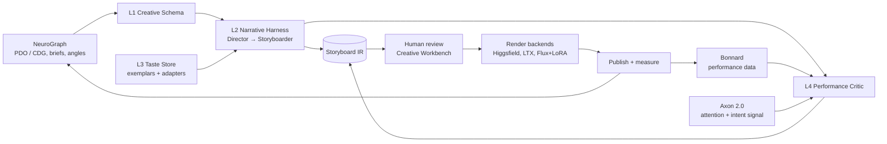
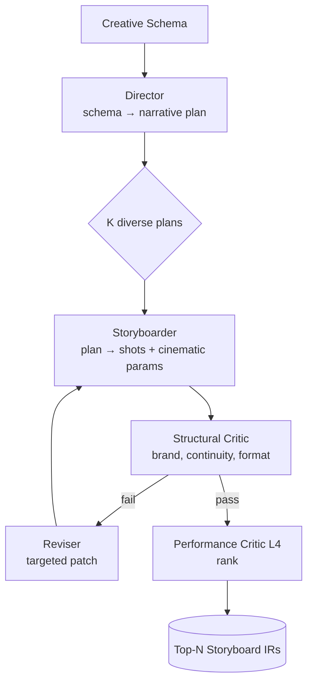
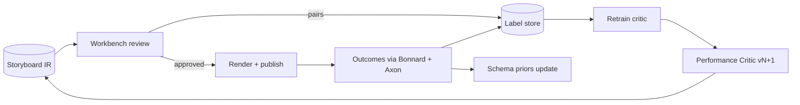

# Atelier Narrative & Storyboard Sub-Module — Technical Requirements Document

2026-09-19 · @Someone

## 1. Purpose, scope, and design principles

This TRD specifies a **Narrative & Storyboard sub-module** for Atelier: a plan-first, taste-conditioned, performance-graded layer that turns a NeuroGraph brief into a structured storyboard intermediate representation (IR) before any pixel or frame is rendered. It elaborates Atelier's existing `TemplateStore` / `VisualTemplate` concept into a full narrative scaffold, and it is the component that carries the brand's *aesthetic* intent while NeuroGraph carries the *functional* intent.

**In scope**

- The symbolic Creative Schema (archetype, beat sheet, hook taxonomy, cinematic grammar, brand constraints) and its JSON contract
- The multi-agent harness that expands schema → narrative → storyboard IR (Director, Storyboarder, Critic, Reviser)
- Taste encoding: exemplar corpus, retrieval, style adapters, diversity controls
- A performance-grounded critic trained on NeuroGraph outcome signal
- Interfaces to the Creative Workbench pipeline (brief → angles → script → review → assets), the CDG/PDO, the FalkorDB Template Graph, and render/publish providers
- Evaluation protocol and stage gates

**Out of scope** (consumed, not built): text-to-image/video rendering, character-consistency models, generic aesthetic reward models, the PDO/CDG itself, Axon event pipeline, Bonnard semantic layer.

**Design principles** (each traces to evidence in §2)

1. **Plan before you draft.** Every asset is generated from an explicit, inspectable narrative plan; flat prompting is never the production path.
2. **Constrain strategy tightly, aesthetics loosely.** Control strength is set per schema dimension, never as one global "creativity" slider.
3. **Taste is a curated dataset, not a prompt.** Brand taste lives in a versioned exemplar corpus plus light adapters; heavy preference-tuning toward any single reward is prohibited by default.
4. **The critic ranks; it does not define quality.** Off-the-shelf LLM judges are filters only. The production critic is purpose-trained and grounded in measured performance.
5. **Diversity is a first-class metric.** Any change that raises mean quality while collapsing distribution spread is a regression and blocks release.
6. **Storyboard is the product artifact.** The IR is editable, versioned, provenance-linked (persona → scenario → decision factor → concept → outcome), and is what humans review.
7. **Rebuild nothing commoditized.** Rendering, consistency, generic aesthetics, and script-to-shot decomposition recipes are adopted from the field; leverage goes into schema, taste, and the performance loop.

## 2. Problem statement and evidence base

The hypothesis that generation works best "backwards from a template" is correct, well-supported, and carries one documented cost: homogenization. The architecture in this document is designed to capture the first and engineer against the second.

**Why plan-first (the coherence gains are large and repeatable)**

| Finding | Source | Implication for Atelier |
| --- | --- | --- |
| Plan-then-write yields stories more diverse, coherent, and on-topic than flat generation | Plan-and-Write, Yao et al., AAAI 2019 ([arXiv:1811.05701](https://arxiv.org/abs/1811.05701)) | Narrative plan is a mandatory intermediate artifact |
| Plan → Draft → Rewrite → Edit gave +14 pts plot coherence, +20 pts premise relevance vs. same-model flat generation | Re3, Yang et al., EMNLP 2022 ([ACL Anthology](https://aclanthology.org/2022.emnlp-main.296/)) | Multi-pass harness with reranking, not single-shot |
| Detailed hierarchical outlining beat Re3 by +22.5 pts coherence, +28.2 pts outline relevance, +20.7 pts interestingness | DOC, Yang et al., ACL 2023 ([arXiv:2212.10077](https://arxiv.org/abs/2212.10077)) | Push creative burden into the plan; expand outline hierarchically |
| Too-high control strength produces narrow, repetitive output; too-low drifts off constraint | DOC, same paper | Control strength must be a tunable, per-dimension parameter |
| Professional writers value hierarchical generation at the arc level but flag missing subtext and logic gaps | Dramatron, Mirowski et al., CHI 2023 ([arXiv:2209.14958](https://arxiv.org/abs/2209.14958)) | Human review at the plan stage, not only at the asset stage |
| General LLMs produce generic shot prompts; a fine-tuned cinematic-language model fixes it | Camera Artist, 2026 ([arXiv:2604.09195](https://arxiv.org/html/2604.09195)) | Fine-tune (or heavily exemplar-prime) the cinematic vocabulary layer specifically |

**Why taste is the actual bottleneck**

- Generic aesthetic rewards (LAION predictor, ImageReward, HPS v2, PickScore) push toward a population mean of "pleasing"; their pure-aesthetics correlation is weak and they are dominated by prompt-alignment signal ([survey, arXiv:2505.17352](https://arxiv.org/pdf/2505.17352)).
- Preference optimization on such rewards causes mode collapse and near-identical outputs (DiverseGRPO, [arXiv:2512.21514](https://arxiv.org/abs/2512.21514)).
- Off-the-shelf LLM judges reach only \~70–73% agreement with human preference on creative writing; purpose-trained reward models reach \~78% (LitBench, [arXiv:2507.00769](https://arxiv.org/abs/2507.00769)). Expert humans themselves agree only moderately (Fleiss κ ≈ 0.41, TTCW, [arXiv:2309.14556](https://arxiv.org/abs/2309.14556)).
- Few-shot style adapters trade off: plain DreamBooth memorizes, Textual Inversion under-fits identity+style, LoRA reduces copying but overfits regularization data ([arXiv:2510.09475](https://arxiv.org/pdf/2510.09475)).

**Why homogenization is the enemy**

Doshi & Hauser (Science Advances 2024) found AI-assisted stories are individually rated more creative and enjoyable yet collectively more similar to each other. Anderson, Shah & Kreminski (C&C 2024) and a PNAS Nexus study found the same narrowing in ideation, persisting across prompt and parameter changes. Structured scaffolding amplifies this effect. For a product whose value is distinctiveness, mean-quality gains that shrink the distribution are net-negative.

**Why the performance loop is the moat**

- Visual features alone predicted display-ad CTR up to 3.27× better than weighted sampling on 6,272 real creatives (Azimi et al., WWW 2012, [PDF](https://archives.iw3c2.org/www2012/proceedings/companion/p457.pdf)).
- Creative drives \~49% of incremental sales in a 450-campaign meta-study — the largest single driver by a wide margin (NCSolutions & Nielsen, Aug 2023, [PDF](https://s3.amazonaws.com/media.mediapost.com/uploads/NCS_Five_Keys_to_Advertising_Effectiveness_E-Book_08-23.pdf)); marketers estimate it at \~19%.
- No published system unifies generative storyboarding with a performance-predictive critic. NeuroGraph's CDG provenance (persona → scenario → decision factor → concept → outcome) plus Axon attention signal is exactly the label source such a critic needs.

## 3. System context

The sub-module sits between NeuroGraph (functional grounding) and Atelier's render/publish backends, and it owns the storyboard IR that every downstream step consumes. It slots into the Creative Workbench pipeline between *angles* and *assets*, replacing the current script step with a richer plan → storyboard step.



Reading: NeuroGraph emits a brief with persona, buyer scenario, decision factors, and recommended angles; the schema layer binds those to a narrative archetype and constraints; the harness produces N candidate storyboards; the critic ranks them; humans review the top candidates in the Workbench; renders are handed to providers; outcomes flow back through Bonnard and Axon to retrain the critic and refine the schema.

**Mapping to existing Atelier protocols**

| Existing Atelier protocol | Sub-module responsibility |
| --- | --- |
| `TemplateStore` / `VisualTemplate` (FalkorDB Template Graph) | Extended to `NarrativeTemplate` nodes: archetype + beat sheet + shot grammar, linked to `VisualTemplate` layouts |
| `GenerationBackend` | Unchanged; now receives per-shot render specs from the storyboard IR instead of a monolithic prompt |
| `Renderer` | Unchanged; consumes IR shots with explicit cinematic parameters and style-adapter references |
| `Critic` | Split into two: a cheap structural/brand Critic (in-harness) and the trained Performance Critic (L4) used as ranker |
| `MemoryProvider` | Gains a Taste Store facet: per-brand exemplar corpus, style adapters, and rejected-candidate history |

**NeuroGraph MCP surfaces consumed** (already exposed): `list_customer_personas`, `get_persona_decision_architecture`, `get_buyer_scenario`, `get_recommended_hook_types`, `get_proven_creative_formulas`, `get_brand_context`, `create_creative_angles`, `analyze_creative`, `compare_creatives`, `handoff_brief_to_provider`, `register_external_assets`. The sub-module adds no new NeuroGraph write surfaces in Stage 1–3; Stage 4 adds a `critic_feedback` write for labeled outcomes.

**Deployment shape**: the harness runs as an Atelier deep-agent graph (Mastra-compatible so it can also be hosted inside Marketing OS). Schema and IR are stored as versioned JSON documents in the Template Graph with FalkorDB edges to CDG entities. Style adapters are stored as artifacts keyed by brand and version. The Performance Critic is a served model behind a scoring endpoint; the harness calls it, never embeds it.

## 4. Layer 1 — Creative Schema (the elaborated template)

The Creative Schema is a symbolic, versioned document that fully specifies *what must be true* of an asset before any model generates anything. It is the durable IP of the sub-module and the direct elaboration of "template" into narrative structure. It is neuro-symbolic in the METATRON / Garden-of-Forking-Paths sense: symbolic scaffold instantiated with controlled randomness, realized by an LLM, coherence-filtered afterward.

**Schema components**

| Component | Contents | Source of vocabulary | Control default |
| --- | --- | --- | --- |
| `strategy` | persona id, buyer scenario, decision factors, objection to neutralize, funnel stage | NeuroGraph PDO/CDG | Hard constraint (1.0) |
| `brand` | voice rules, banned claims, mandatory assets, palette, typography, distinctive brand assets | `get_brand_context`, brand guide | Hard constraint (1.0) |
| `archetype` | narrative arc (e.g. rags-to-riches, man-in-hole, transformation, problem-agitate-solve, testimonial-proof), Polti dramatic situation, right-brain feature targets (character, scene, place, humor, melody) | Reagan et al. arc shapes; Polti; System1 *Lemon* feature set | Soft (0.7) |
| `hook` | hook type from NeuroGraph's ranked taxonomy, first-1.5s attention device, distinctive-asset placement | `get_recommended_hook_types`, Nelson-Field/VCCP 1.5s finding | Soft (0.8) |
| `beats` | ordered beat sheet: beat id, narrative function, emotional target, duration budget, required proof element | Save-the-Cat / three-act compressed to ad length | Soft (0.6) |
| `shot_grammar` | allowed shot sizes, angles, movements, transitions, continuity rules, edit rhythm envelope | Camera Artist / CANVAS cinematic fields; 180° rule | Soft (0.5) |
| `freedom` | dimensions explicitly left open: imagery, phrasing, casting, setting, surprise element | — | Open (0.2) |
| `format` | channel, aspect ratio, duration, safe zones, caption rules | Channel specs | Hard constraint (1.0) |

Control default = the initial per-dimension control strength consumed by the harness (§5). Values are tunable per brand and per campaign and are the primary lever against both drift (too low) and homogenization (too high).

**JSON contract (abridged)**

```json
{
  "schema_version": "1.0",
  "schema_id": "cs_01J...",
  "strategy": {"persona_id": "per_...", "scenario_id": "bs_...", "decision_factors": ["df_..."], "funnel_stage": "consideration"},
  "brand": {"brand_id": "...", "voice_rules": ["..."], "banned_claims": ["..."], "distinctive_assets": ["asset_..."]},
  "archetype": {"arc": "transformation", "polti": 21, "features": ["character", "place", "humor"]},
  "hook": {"type": "pattern_interrupt", "attention_device": "distinctive_asset_first_frame"},
  "beats": [
    {"id": "b1", "function": "hook", "emotion": "curiosity", "duration_s": [0, 1.5]},
    {"id": "b2", "function": "tension", "emotion": "recognition", "duration_s": [1.5, 5]},
    {"id": "b3", "function": "turn", "emotion": "relief", "duration_s": [5, 9], "proof": "df_..."},
    {"id": "b4", "function": "resolution_cta", "emotion": "confidence", "duration_s": [9, 12]}
  ],
  "shot_grammar": {"sizes": ["CU", "MS", "WS"], "movements": ["static", "slow_push"], "max_cuts": 6},
  "control": {"strategy": 1.0, "brand": 1.0, "archetype": 0.7, "hook": 0.8, "beats": 0.6, "shot_grammar": 0.5, "freedom": 0.2},
  "provenance": {"brief_id": "...", "angle_id": "...", "template_graph_node": "nt_..."}
}
```

**Storage and graph binding**

- Each schema is a `NarrativeTemplate` node in the FalkorDB Template Graph with edges: `GROUNDED_IN → Persona`, `TARGETS → DecisionFactor`, `USES_HOOK → HookType`, `REALIZED_AS → Storyboard`, `MEASURED_BY → Outcome`. This makes every asset's strategy provenance queryable, consistent with the Aug 2026 asset-catalog positioning.
- Archetype and hook vocabularies are enumerations owned by NeuroGraph (so `get_proven_creative_formulas` and `get_taxonomy_summary` can rank them from data); beat and shot grammars are owned by the sub-module.
- Schemas are immutable once a storyboard is generated from them; edits produce a new version with a `derived_from` edge.

**Requirements**

- R4.1 A schema MUST round-trip a human art director's brief with no loss of strategic intent (tested by blind reconstruction, §9).
- R4.2 Every soft dimension MUST carry a control-strength value in \[0,1\]; hard constraints are validated deterministically before generation.
- R4.3 The `freedom` block MUST be non-empty; a schema that constrains every dimension is rejected as over-specified.
- R4.4 Archetype and hook enums MUST resolve to NeuroGraph taxonomy ids so performance can be attributed to them.

## 5. Layer 2 — Narrative & Storyboard Harness

The harness is a four-role, multi-pass agent graph that converts a Creative Schema into K ranked Storyboard IRs. It reuses the validated Plan → Draft → Critique → Revise shape (Re3/DOC) and the Director → Cinematographer decomposition that the 2025–26 storyboard-agent literature has converged on (MovieAgent, Camera Artist, CANVAS, Dialogue Director).



Reading: the Director produces K structurally distinct plans in parallel (not sequential refinement); each is boarded independently; the cheap structural critic gates on hard constraints; only survivors are ranked by the trained critic.

**Roles**

| Role | Input | Output | Model tier | Notes |
| --- | --- | --- | --- | --- |
| Director | Schema + retrieved exemplars (L3) | Narrative plan: premise, beat realizations, character/setting bible, emotional curve | Frontier LLM | Generates K plans with *anchorless* diversification: distinct seeds, distinct exemplar subsets, distinct archetype variants within the allowed set |
| Storyboarder | Narrative plan + shot grammar + style adapter refs | Storyboard IR: ordered shots with cinematic fields, on-screen text, VO, render spec per shot | Cinematic-tuned LLM (LoRA on shot vocabulary) | Recursive shot generation as in Camera Artist; continuity memory graph as in CANVAS/StoryBlender |
| Structural Critic | Storyboard IR + schema hard constraints | Pass/fail + typed violations | Small model + deterministic checks | Never scores taste; checks brand rules, banned claims, format, continuity, beat coverage, duration budget |
| Reviser | IR + violations | Patched IR | Same as Storyboarder | Patch-only edits; forbidden from rewriting untouched shots (guards against over-editing/drift) |

**Per-dimension control strength.** Control values from the schema are applied at three points: (1) as instruction weight in the Director prompt (hard dims stated as invariants, soft dims as "prefer", open dims as "choose freely"); (2) as sampling temperature per generation head where the backend allows; (3) as validator strictness in the Structural Critic (hard = reject, soft = warn + score penalty, open = ignore). This is how the harness gets DOC's coherence gain without its repetitiveness.

**Diversity enforcement (mandatory).** Before ranking, the K candidates are embedded (text embedding of plan + CLIP embedding of any keyframes) and a pairwise diversity score is computed. If mean pairwise distance falls below the brand's floor (§9), the Director is re-run with an explicit "differ from these" instruction and rotated exemplars. Ranking never returns two candidates closer than the floor.

**Critique discipline.** The Structural Critic and Reviser are the only in-loop critique. Free-form LLM self-critique ("make it better") is disallowed in the production path because of documented self-bias amplification and style-over-substance drift. Quality judgment is delegated to the L4 ranker and to humans.

**Storyboard IR (abridged)**

```json
{
  "ir_version": "1.0", "storyboard_id": "sb_...", "schema_id": "cs_...", "plan_id": "pl_...",
  "bible": {"characters": [...], "setting": "...", "style_adapter": "brand_x/v3"},
  "shots": [
    {"id": "s1", "beat": "b1", "t": [0, 1.5], "size": "CU", "angle": "eye", "move": "static",
     "subject": "...", "action": "...", "vo": "...", "text_overlay": "...",
     "render_spec": {"backend": "flux", "prompt": "...", "refs": ["asset_..."], "seed": 41}}
  ],
  "continuity": {"axis": "left_to_right", "lighting": "warm_key"},
  "scores": {"structural": "pass", "performance": 0.71, "diversity_rank": 2},
  "provenance": {"exemplars_used": ["ex_..."], "critic_version": "pc_v0.3"}
}
```

**Requirements**

- R5.1 K ≥ 4 candidates per run by default; K and the diversity floor are per-brand config.
- R5.2 Every shot MUST reference exactly one beat; every beat MUST be covered by ≥ 1 shot (checked deterministically).
- R5.3 The Reviser MUST emit a diff, never a full regeneration; diffs are stored for audit.
- R5.4 The harness MUST be resumable at plan, board, and ranked stages so a human can intervene at the plan level (Dramatron finding).
- R5.5 Latency budget: plan + board + structural gate ≤ 90 s for K = 4 at 12 s duration; ranking adds ≤ 10 s.

## 6. Layer 3 — Taste Encoding

Brand taste is encoded as a curated, versioned exemplar corpus with retrieval, plus lightweight style adapters. Heavy preference-tuning toward a single reward is prohibited by default. This is the lowest-risk path the evidence supports and it composes with the Aug 2026 asset-catalog motion: the brand's ingested creative *is* the initial taste corpus.

**Taste Store contents (per brand)**

| Artifact | What it holds | Minimum to activate | Refresh |
| --- | --- | --- | --- |
| Exemplar corpus | Ingested brand assets + approved Atelier outputs, each tagged with schema fields (archetype, hook, beats), CDG provenance, human rating, outcome | 20 tagged assets for retrieval; 100+ for adapters | On every approval or ingest |
| Anti-exemplars | Rejected candidates and off-brand competitor references, with rejection reason | 10 | On every rejection |
| Style adapter | Per-brand visual LoRA (or IP-Adapter/StyleDrop reference set) for the render backend; per-brand text style vector for the Storyboarder | 100+ curated frames | Retrain on corpus milestones only |
| Cinematic LoRA | Shared (not per-brand) adapter that teaches the Storyboarder professional shot vocabulary | One-time | Quarterly |
| Taste profile | Human-readable brand aesthetic statement + weighted feature preferences derived from approvals | Written by brand owner | Reviewed quarterly |

**Retrieval into the harness**

- Director receives 3–5 exemplars per plan, selected by a two-stage query: filter by schema strategy match (same persona or decision factor), then rank by embedding similarity to the schema's archetype and hook, then apply a diversity re-ranker so no two plans see the same exemplar set.
- Anti-exemplars are supplied to the Structural Critic as negative references, never to the Director (avoids anchoring on what to avoid).
- Exemplar selection is logged in IR provenance so approval/rejection can be attributed back to exemplars (this is how the corpus self-curates).

**Adapters: rules of engagement**

- Visual adapter: prefer reference-conditioning (IP-Adapter / StyleDrop-style) for brands under 100 curated frames; train LoRA only above that threshold, with regularization images drawn from the brand's own non-hero assets to reduce the overfit-to-regularization failure documented in the few-shot literature.
- Text adapter: a style vector (activation steering) or a small LoRA on the Storyboarder for voice; never fine-tune the Director on brand data (the Director must stay a strong general planner).
- No DPO/GRPO-style preference optimization on generation models before Stage 4, and then only with an explicit diversity term and a held-out diversity gate.

**Diversity preservation**

- Corpus-level: track semantic spread of approved assets per brand over time; a shrinking spread triggers a curation review (the corpus is homogenizing).
- Run-level: the harness diversity floor (§5) is set from the corpus spread so a brand with a tight aesthetic is not penalized for consistency, while a broad brand is pushed to explore.
- Human-in-loop: reviewers are shown candidates sorted to maximize contrast (not top-score first) for the first pick, to counter the anchoring effect documented in ideation studies.

**Cold start.** A new brand starts with ingested assets only (asset-catalog path). If fewer than 20 tagged assets exist, the harness runs with archetype/hook priors from `get_proven_creative_formulas` across NeuroGraph's cross-client taxonomy and a vertical-level exemplar pool, clearly flagged as non-brand. Synthetic exemplar generation is permitted only to seed the anti-exemplar set.

**Requirements**

- R6.1 Every exemplar MUST carry schema tags and CDG provenance; untagged assets are not retrievable.
- R6.2 Adapter training MUST be reproducible from a corpus snapshot id.
- R6.3 Taste Store writes MUST be append-only with versioning; rejections are data, never deletions.
- R6.4 Cross-brand leakage is forbidden: retrieval and adapters are partitioned by brand id; the shared cinematic LoRA contains no brand assets.

## 7. Layer 4 — Performance-Grounded Critic

The Performance Critic is a purpose-trained ranking model that scores a Storyboard IR for *predicted behavioral effect on the target persona*, not for generic aesthetic appeal. It is the component that unifies the two unconnected literatures (visual-feature CTR prediction and creative-attribute tagging) into a generate → predict → select loop, and it is where NeuroGraph's data is a moat that no generation-only tool can replicate.

**Role boundary.** The critic is a ranker over K structurally valid candidates. It never gates alone: a candidate the critic scores low can still be chosen by a human, and that choice is a training label. The critic is never used as an RL reward for the generation models before Stage 4 gates pass.

**Inputs (feature groups)**

| Group | Features | Source |
| --- | --- | --- |
| Schema | archetype, hook type, beat functions, control values | Creative Schema |
| Narrative | plan embedding, emotional-curve vector, beat coverage, VO/text embedding | Harness |
| Visual | keyframe CLIP embeddings, composition features (contrast, salient-object count, rule-of-thirds, hue count), distinctive-asset presence and first-frame timing | Rendered keyframes; Azimi-style feature set |
| Persona fit | cosine between candidate embedding and persona decision-architecture embedding; decision-factor coverage | PDO / `get_persona_decision_architecture` |
| Context | channel, format, placement, spend tier | Brief |

**Labels (in priority order)**

1. Measured outcome on a published asset: CTR, thumb-stop / 3s hold, conversion, and Axon 2.0 attention-intent signal, normalized per brand and channel (Bonnard).
2. Human pairwise preference from Workbench review (which candidate was approved, and the rejected siblings from the same run — these are ideal pairs because schema and persona are held constant).
3. NeuroGraph `analyze_creative` / `compare_creatives` scores on ingested assets, used as weak labels for warm start.

**Model.** Start with a pairwise Bradley–Terry ranker over the feature groups (LitBench shows BT and generative reward models tie at \~78% on creative preference; BT is cheaper, more auditable, and less prone to verbose-output bias). Train per vertical with brand as a feature, not per brand alone (a 200-asset single-brand model does not transfer). Add a generative rationale head only for reviewer-facing explanations, never for the score.

**Warm start path.** Before any Atelier assets are published, train on NeuroGraph's ingested asset catalog: existing brand creative already has strategy provenance and outcome data from the asset-catalog motion. This is the only reason a Stage 4 critic is buildable early.

**Anti-reward-hacking controls**

- Diversity term: the ranked list is re-ranked with a determinantal / MMR penalty so top-N is both high-scoring and spread.
- Feature attribution audit: SHAP on every release; if trivial features (text density, saturation) dominate, the release is blocked.
- Held-out brands: validation always includes brands unseen in training.
- Drift monitor: critic score distribution per brand is tracked; a sudden narrowing is treated as collapse.

**Feedback loop**



Reading: every review produces preference pairs; every publish produces outcome labels; both retrain the critic on a cadence; outcomes also update the archetype/hook priors in NeuroGraph's taxonomy so the schema layer learns which structures work per persona.

**Requirements**

- R7.1 The critic MUST beat an off-the-shelf aesthetic scorer (PickScore or HPS v2) at predicting held-out outcomes before it is used in ranking.
- R7.2 Target ≥ 73% agreement with human preference at first release (the off-the-shelf LLM-judge ceiling), rising to ≥ 78% (trained-model benchmark) by the third retrain.
- R7.3 The critic MUST expose per-feature-group contributions for every score.
- R7.4 Retraining MUST be reproducible from a label-store snapshot; label provenance (outcome vs. human vs. weak) is stored per row.
- R7.5 The `critic_feedback` write to NeuroGraph MUST carry storyboard id, schema id, label type, and label value so the CDG can attribute outcomes to creative structure.

## 8. Data contracts and interfaces

Five interfaces bound the sub-module. All are JSON over the existing Atelier protocol surfaces or NeuroGraph MCP; none require a new transport.

| Interface | Direction | Contract | Owner |
| --- | --- | --- | --- |
| Brief → Schema | NeuroGraph → sub-module | `brief_id`, persona/scenario/decision-factor ids, angle ids, brand context, channel spec → Creative Schema (§4). Deterministic compile plus one LLM step to choose archetype among taxonomy-ranked options | Sub-module |
| Schema → IR | Internal | Creative Schema → K Storyboard IRs (§5) | Sub-module |
| IR → Render | Sub-module → `GenerationBackend` / providers | Per-shot `render_spec` with backend, prompt, reference assets, style adapter id, seed; provider handoff via `handoff_brief_to_provider` carrying `storyboard_id` | Atelier |
| IR → Review | Sub-module → Creative Workbench | Top-N IRs with scores, provenance, diffs, keyframes; review returns approve/reject/edit + reviewer pairs | Workbench |
| Outcome → Critic | Bonnard + Axon → label store | `storyboard_id`, `asset_id`, channel, metric set, normalized score, attention-intent series | NeuroGraph |

**Brief → Schema compile rules**

- Hard constraints are copied verbatim from brand context and channel spec; the compiler never invents a constraint.
- Archetype and hook are chosen from the top-3 candidates returned by `get_proven_creative_formulas` and `get_recommended_hook_types` for the persona, with the choice logged; if no ranked data exists the compiler emits the archetype as an open dimension and flags the schema as cold-start.
- Decision factors from `get_persona_decision_architecture` map to beat `proof` fields: each primary factor must be carried by at least one beat.

**Provider handoff.** The IR is provider-agnostic. A provider adapter renders each shot's `render_spec` into that provider's request shape (Higgsfield generate\_image/video, LTX storyboard import, Flux + LoRA on the internal backend). Returned assets are registered via `register_external_assets` with the originating `storyboard_id` and `shot_id` so the asset catalog keeps shot-level provenance.

**Storage**

| Object | Store | Key | Retention |
| --- | --- | --- | --- |
| Creative Schema | Template Graph (FalkorDB) + JSON blob | `schema_id` | Immutable, versioned |
| Narrative plan, Storyboard IR | JSON blob store, graph edge to schema | `plan_id`, `storyboard_id` | Immutable; rejected candidates kept 12 months |
| Exemplars, anti-exemplars, adapters | Taste Store (blob + BigQuery index) | `brand_id`, `exemplar_id`, `adapter_version` | Append-only |
| Labels | BigQuery (Dagster/dbt managed) | `storyboard_id`, `label_type` | Permanent |
| Critic models | Model registry | `critic_version` | Permanent |

**Versioning and idempotency.** Every generation run is keyed by `(schema_id, taste_snapshot_id, critic_version, harness_version, seed)`; re-running with the same key reproduces the same top-N. Any change to a component bumps its version and appears in IR provenance.

**Security and tenancy.** All stores are partitioned by `brand_id`. The shared cinematic LoRA and cross-client taxonomy priors are the only cross-tenant artifacts and contain no brand assets or copy.

## 9. Evaluation and benchmarks

Ground truth is pairwise human preference on a fixed rubric; the trained critic is the scalable proxy; generic automated metrics and raw LLM judges are never release criteria. Every stage in §10 has a gate drawn from this section.

**Human pairwise protocol**

- Unit: two Storyboard IRs (with keyframes) from the same schema and persona, shown side by side to a reviewer who knows the brand.
- Rubric (each 1–5, plus an overall pick): on-strategy, on-brand, coherence, distinctiveness/surprise, predicted-to-perform.
- Panel: minimum 3 reviewers per pair; track inter-rater agreement (target Krippendorff α ≥ 0.6; expert agreement on creative quality is inherently moderate, so α below 0.4 signals a rubric problem, not a model problem).
- Volume: 200 pairs per brand per evaluation cycle; pairs are drawn to include harness vs. flat-prompt baseline, harness vs. previous harness version, and critic-top vs. critic-bottom.

**Automated metrics (tracked, not gating alone)**

| Metric | Definition | Use |
| --- | --- | --- |
| Diversity spread | Mean pairwise embedding distance across the K candidates and across approved assets per brand over a rolling 30 days | Hard gate: no release may reduce it by > 10% |
| Structural pass rate | Share of candidates clearing the Structural Critic on first pass | Harness health; target ≥ 80% |
| Beat coverage | Share of beats carried by ≥ 1 shot with a matching proof element | Must be 100% |
| Critic–human agreement | Share of human pairwise picks matched by critic ranking | Gate for using the critic in ranking (R7.2) |
| Critic–outcome correlation | Spearman between critic score and normalized outcome on published assets, held-out brands | Gate for Stage 4 |
| Reviewer edit distance | Size of human edits to the approved IR before render | Proxy for plan quality; trend down |

**Baselines**

1. Flat prompt: single-shot generation from brief text with the same render backend.
2. Current Workbench script step: brief → angle → script → assets as run today.
3. Off-the-shelf aesthetic ranker: PickScore / HPS v2 applied to rendered keyframes in place of the Performance Critic.

**Stage gates**

| Gate | Criterion | Evidence basis |
| --- | --- | --- |
| G1 Schema | Blind reconstruction: an art director's brief → schema → brief re-written by a second person matches strategic intent on ≥ 90% of items | R4.1 |
| G2 Harness | Harness beats flat prompt on blind pairwise preference by ≥ 15 pts (DOC-scale gain was \~20 pts on interestingness); diversity spread not reduced | Re3 / DOC |
| G3 Taste | On-brand approval rate ≥ 70% on first review for brands with ≥ 100 exemplars; diversity spread within 10% of the ingested corpus spread | Few-shot adapter literature; homogenization studies |
| G4 Critic | Beats aesthetic-ranker baseline on held-out outcome correlation; ≥ 73% human agreement | LitBench; Azimi et al. |
| G5 Loop | After two retrains, critic–outcome Spearman improves and top-ranked assets outperform reviewer-picked-only assets on live spend in an A/B | NCSolutions creative-share finding |

**Live measurement.** Published assets are A/B tested against the incumbent Workbench output on the same persona and channel. Primary metric per channel is chosen from the label set in §7; secondary is Axon attention-intent. Brand lift studies are out of scope for the sub-module but their results are ingested as labels when available.

## 10. Build plan

Five stages, each gated by §9, sequenced so the schema and label pipeline exist before any model is trained. Stages 1–2 resume the paused Atelier Phase 0 scaffold; the critic (Stage 4) can start in parallel from Stage 2 because its warm-start data comes from the asset catalog, not from Atelier output.

| Stage | Deliverable | Depends on | Gate | Indicative effort |
| --- | --- | --- | --- | --- |
| 1 Schema | Creative Schema spec, compiler from brief, `NarrativeTemplate` nodes in Template Graph, archetype/hook enums registered in NeuroGraph taxonomy | Existing PDO, `get_brand_context`, Template Graph | G1 | 3–4 weeks, 1 engineer + Garrett on vocabulary |
| 2 Harness | Director / Storyboarder / Structural Critic / Reviser graph on Atelier protocols, IR spec, resumable stages, Workbench review view of IRs | Stage 1 | G2 | 5–6 weeks, 2 engineers |
| 3 Taste | Taste Store on `MemoryProvider`, exemplar tagging from ingested assets, retrieval + diversity re-ranker, reference-conditioning path, first brand LoRA where corpus permits, shared cinematic LoRA | Stage 2; asset-catalog ingest | G3 | 4–5 weeks, 1–2 engineers |
| 4 Critic | Label store in BigQuery, BT ranker v0 trained on ingested-asset outcomes, scoring endpoint, SHAP audit, `critic_feedback` write | Bonnard, Axon, asset catalog (can start at Stage 2) | G4 | 5–6 weeks, 1 ML engineer |
| 5 Loop | Reviewer-pair capture, outcome ingestion, retrain cadence, schema-prior update into taxonomy, live A/B | Stages 3–4 | G5 | 3–4 weeks, then ongoing |

**Sequencing notes**

- Stage 1 vocabulary work is the highest-leverage founder time: archetype, hook, and beat enums encode the house point of view and are hard to change once outcomes attach to them.
- Stage 2 ships with flat-prompt and current-script baselines wired into the same review view so G2 is measured from day one.
- Stage 3 uses reference-conditioning only until a brand crosses 100 curated frames; the first LoRA candidate is Arthaus (largest owned corpus, Room Themes give natural archetype variety).
- Stage 4 v0 is trained before any Atelier-generated asset is published; v1 is the first retrain that includes reviewer pairs.

**Thresholds that change the plan**

- Style LoRA shows training-copy artifacts on ≥ 2 brands → drop LoRA, retrieval + reference-conditioning only.
- Critic v0 cannot beat the aesthetic-ranker baseline on held-out outcomes → pause Stage 5, invest in label quality and Axon coverage; do not scale generation on an unvalidated ranker.
- Diversity spread falls > 10% under any tuning → revert that tuning, rely on structured diverse sampling.
- Harness fails G2 → the schema is under-specified or over-specified; re-tune control defaults before touching models.
- Reviewer edit distance does not trend down over three cycles → the Director, not the Storyboarder, is the weak link; add plan-level review earlier.

**Immediate next actions**

- [ ] Approve the Creative Schema component list and control defaults (§4)
- [ ] Confirm Stage 1 starts from the paused Atelier Phase 0 scaffold and its handoff doc
- [ ] Nominate the first two client brands for G2/G3 evaluation alongside Arthaus
- [ ] Confirm Bonnard exposes per-asset outcome metrics at the granularity §7 needs

## 11. Risks, open questions, and what not to build

The two risks that can sink the sub-module are homogenization and an unvalidated critic; both have hard gates in §9. Everything below is secondary.

**Risks**

| Risk | Likelihood | Impact | Mitigation |
| --- | --- | --- | --- |
| Homogenization: structure + taste tuning narrows output to a house mean | High | High | Diversity spread as a hard gate; anchorless K-plan generation; contrast-sorted review |
| Critic reward hacking: ranker learns trivial visual features | Medium | High | SHAP audit per release; held-out brands; MMR re-rank; critic never used as RL reward before G5 |
| Label sparsity: too few published assets per brand for outcome labels | High early | Medium | Per-vertical training with brand as feature; reviewer pairs as primary early label; asset-catalog warm start |
| Schema over-specification: control defaults too tight, outputs generic | Medium | Medium | Mandatory non-empty `freedom` block; G2 baseline comparison; per-dimension tuning |
| Cinematic-language quality: Storyboarder emits generic shots | Medium | Medium | Shared cinematic LoRA; Camera Artist-style recursive shot generation; shot grammar validation |
| Provider drift: render backends change prompt semantics | Medium | Low | Provider adapters isolate IR from provider request shapes; seeds and refs stored per shot |
| Cross-tenant leakage via shared adapters | Low | High | Shared artifacts contain no brand assets; partition audit in CI |
| Reviewer fatigue on pairwise protocol | Medium | Medium | Cap at 200 pairs per cycle; capture pairs from natural approvals, not only dedicated sessions |

**Open questions**

- Should archetype and hook enums be owned by NeuroGraph's taxonomy from day one, or by the sub-module until outcome data justifies promotion? (This TRD assumes NeuroGraph ownership.)
- Is the Storyboard IR the review artifact, or does review happen on rendered keyframes only? (Assumed: IR plus keyframes; plan-level review is available but optional.)
- What is the minimum Axon 2.0 coverage per brand for attention-intent to be a usable critic label?
- Does the programmatic/DSP up-market direction change the format block (more sizes, shorter durations) enough to warrant a format-specific Storyboarder head?
- How does the ontology-bound image autoencoder research direction feed the critic's visual feature group — as a replacement for CLIP embeddings, or as an additional group?

**Do not build**

- Text-to-image/video models, character-consistency models, or upscalers: consume Higgsfield, LTX, Flux + LoRA.
- A generic aesthetic reward model: use PickScore / HPS v2 as a baseline only.
- A script-to-shot decomposition research program: the recipe is documented; implement it.
- A universal cross-brand taste model: per-vertical with brand features is the ceiling the evidence supports.
- Free-form LLM self-critique loops in the production path.
- A storyboard editor UI from scratch: the Workbench review view renders the IR; LTX-style editing is a later import path, not a build.

**Sources**

Evidence cited in §2 is the primary basis; full literature synthesis with dated citations is in the companion research report *On-Taste Storyboards and Narratives for AI Creative Agents* produced 2026-09-19. Internal references: Atelier Phase 0 handoff doc (repo `docs/`), layout\_synth pipeline design, NeuroGraph Aug 2026 repositioning notes.
